# ReadME - Project Instruction
Portfolio Project 4 – User SureDeveloping – Code Institute
## Introduction
"The website is a blog focused on caves. It's a place where cave enthusiasts can share their experiences by creating posts. Users can also comment on each other's posts. To get started, users need to set up a user accont. The blog is meant to be a space for like-minded individuals to connect, share experiences, and offer tips and advice for future cave visits. 
[Link to the deployed Project](https://cave-blog-5fd1224bbbc5.herokuapp.com/)

## Contents
[Contents](#contents) \
[User experience (UX)](#user-experience)\
    [Project goals](#target-audience)\
    [Target audience](#target-audience)\
    [User requirements and expectations](#user-requirements-and-expectations)\
[Epics and user stories](#user-story)\
    [Initial epics)](#initial-epics-for-an-mvp)\
    [Initial userstories )](#initial-userstories-for-an-mvp)\
[Design](#design) \
    [Color](#color) \
    [Typography](#typography) \
    [Imagery](#imagery) \
[Wireframe](#wireframe) \
    [Homepage](#homepage) \
    [Create blog post](#create-blog-post) \
    [Update blog post](#update-blog-post) \
    [Delete blog post](#delete-blog-post) \
    [My profile](#my-profile) \
    [Update profile](#update-profile) \
    [Delete profile](#delete-profile) \
    [Logout](#logout) \
    [Register](#register) \
[Database Schema](#database-schema) \
    [Entity relationship diagram](#entity-relationship-diagram) \
[Features](#features) \
    [Implemented features](#implemented-features) \
    [Future features](#futur-features) \
[Technologies used](#technologies-used) \
    [Languages and framework](#languages-and-framework) \
    [Database](#database) \
    [Technologies and tools](#technologies-and-tools) \
[Deployment](#deployment) \
    [Pre deployment](#pre-deployment) \
    [Deploying with heroku](#deploying-with-heroku) \
    [Fork the repository](#fork-the-repository) \
    [Clone the repository](#clone-the-repository) \
[Testing](#testing) \
    [Manual testing](#manual-testing) \
    [Tool testing](#tool-testing) \
    [Fixed bugs](#tool-testing) \
    [Known unfixed bugs](#known-unfixed-bugs) \
[Credits](#credits) \
    [Code materials used](#code-materials-used) \
    [Content on the website](#content-on-the-website) \
[Acknowledgments](#acknowledgments)

## User experience (UX)
### Project goal
The main goal of the project is it to offer an exchange opportunity for people who like caves and visit them.

### Target audience
The main target group in are:
* People who like to visit caves and share their experiences.
* People who want to find out about caves they might want to visit.

### User requirements and expectations
As a first time user of the website, you want to:
* know what the website is about.
* read existing blog posts.
* register and create a new user account.
* login and logout.
* comment on existing blog posts.
* create a first blog post.

As a frequent user of the website, I want to:
* login and logout.
* Update existing blog posts and comments.
* Read new blog posts and comments.
* create a new blog posts.
* comment on a blog posts.

As operator of the website I want to:
* provide an easy to navigate and intuitive website.
* provide a feedback of all user inputs.
* provide an error free website.
* provide an a useful and fun app to many users.
* Provide the possibility to create, read, update and delete blogposts, comments and userprofiles.

### Epics and user stories
## Initial epics
* A blog post app with CRUD function. Create a post, update post, detail post and delete a post. 
* A welcome section on top of the Homepage, followed from all existing blog posts as an overview.
* Database and admin setup
* Register page with form
* Login page with form
* Navigation bar that shows the logged in user
* An account app with all user profiles with CRUD functionality
* A Comment function for the blog posts with CRUD functionality

## Initial user stories
* As a user, I want like to know what the website is about and made for
* As a user i want to see all Blog postes
* As a admin i want to have the overall control of the website
* As a user, I want to create my own account
* As a user, I want to login my own account
* As a user, I want to navigate through the subpages of the website when iam login
* As a user i want to write my post with a rich text editor for eaysy handling and styling
* As a user i want to create a blog post
* As a user i want to update a blog post
* As a user i want to read a blog posts
* As a user i want to delite a blog post
* As a user, I would like to protect my blog entries from unauthorized editing or deletion
* As a user I would like to be automatically noted as author when I create a new post editing or deletion
* As a user i want to create a comment
* As a user i want to update a comment
* As a user i want to read a comment
* As a user i want to delite a comment
* As a user i want to create a Userprofile
* As a user i want to update a  Userprofile
* As a user i want to read my Userprofile
* As a user i want to delite my Userprofile

## Design
### Color scheme
I used the website [Coolors](https://coolors.com/) to find colors that go together. 

Finally, I checked the contrast again with [Contrast-grid](contrast-grid.eightshapes.com/). I added here the red and blue. These are bootstrap standart coolor which i used for the buttons. 

### Typography
Tho font in the project is PT Sans, a sans-serif googlefonds

### Imagery
There is only one images in this project. The default userprofile picture is a picture from [Freepik](https://freepik.com/).
The uplosding funtion is deactivated. The uploading function with cloudinary was not working shorly before the deployment. This function will be added in a later realize.

### Wireframe
Wireframe for the homepage:
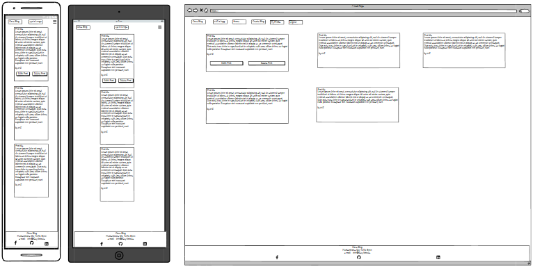

Wireframe for the register page:
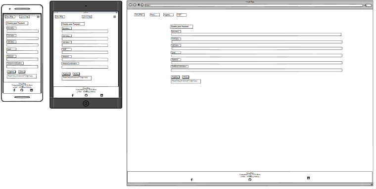

Wireframe for the login page:
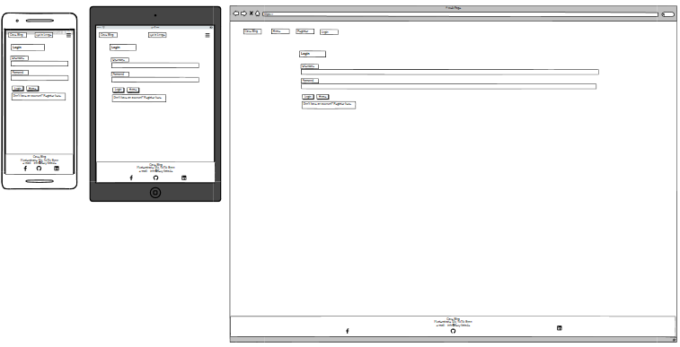

Wireframe for the create blog post page:
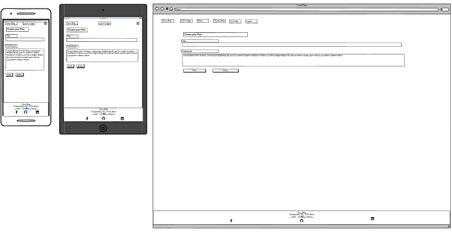

Wireframe for the update blog post page:

Wireframe for the delete blog post page:
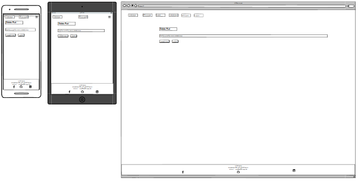

Wireframe for the detail blog post page:

Wireframe for the create userprofile page:
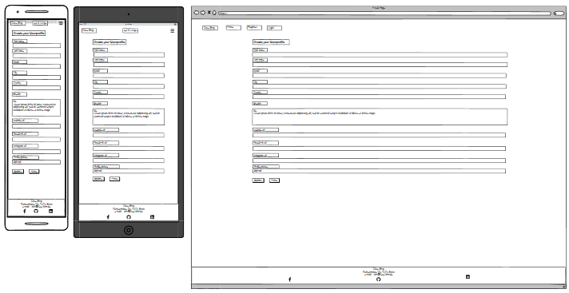

Wireframe for the update userprofile page:
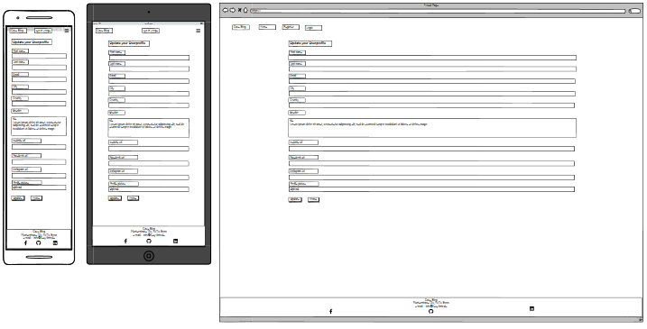

Wireframe for the userprofile page:
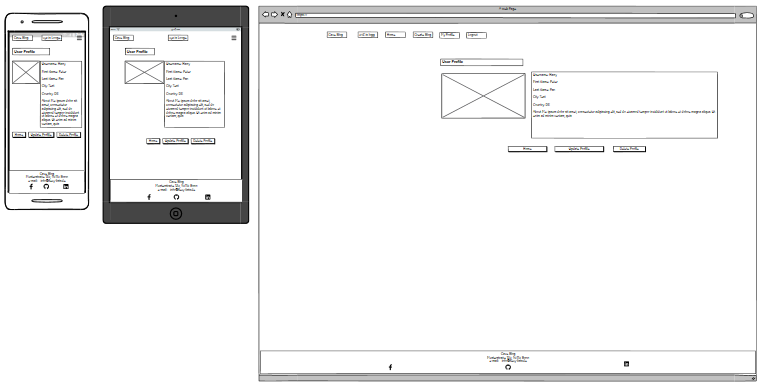

Wireframe for the delete userprofile page:
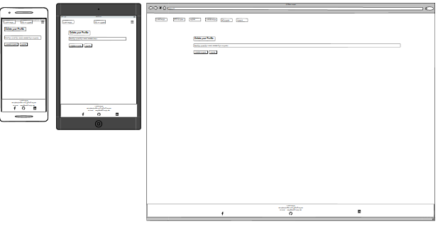

Wireframe for the comment overview on the blog detail page:
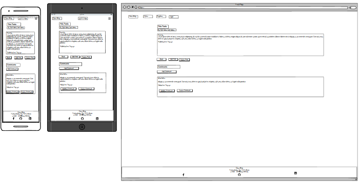

Wireframe for the create comment page:

Wireframe for the update comment page:
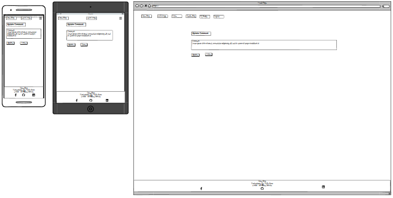

Wireframe for the delete comment page:
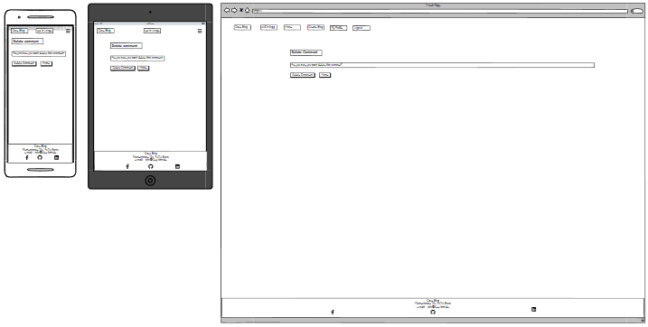

### Features
The website is a Blog about caves. 

### Accessibility
To ensure Accessibility the following things were done:
- I used semantic HTML.
- I used descriptive alt attributes for images.
- I provided information for screen readers.
- I used good color contrast and a tested color palette.

## Technologies used
### Languages used
HTML, CSS and Java Script were used for this project.
### Software used
Balsamiq - To create a wireframe.  
Gitpod - To code the website.  
Git - For version control.  
Github - To store and deploy the website.  
Google Fonts - All fonts used are from google fonts.  
gauger.io/fonticon - To create a favicon.  
Google Dev Tools, and Lighthouse - For troubleshooting testing and fixing bugs.  
Deepl - For translating text.  
Birme - To change the image to webp format and reducing the size of the images.  
Am I Responsive? - To check if the page is responsive.  
## Deployment
The project was coded with gipod and then deployed on heroku. That is how the deployment was done:

## Testing
The page was tested on different ways and different errors came to light. All tests are listes on a seperate page. Please follow the link.
 [Link to the testing page](https://cave-blog-5fd1224bbbc5.herokuapp.com/)

### Solved bugs
- 
### Known unsolved bugs
- There are ...
## Credits
### Code used
- I used th

### Content on the website
The content of this project was written by Stephan Sure und the held of the ai toll of chatgpt.
### Learning materials
- All content from nnline course in "Full Stack Software Developmen" especially videos about Portfolio Project 2 and ReadME from Code Instituet
- https://www.youtube.com/watch?v=40vLxYUJiQY&list=PL_7334VduOHvzZYlgy_0kZLcic2NINCUt&index=6 - Video about the Profolio Project 2
- https://www.youtube.com/watch?v=U9VF-4euyRo&t=831s - Video about css and clamp function
- https://www.youtube.com/watch?v=eHPLTDOAggc - To lern how to make the buttons work
- https://www.youtube.com/watch?v=riDzcEQbX6k - How to bulid a quizz with java script
- https://www.youtube.com/playlist?list=PLB6wlEeCDJ5Yyh6P2N6Q_9JijB6v4UejF  - How to bulid a quizz with java script
- https://www.youtube.com/watch?v=PBcqGxrr9g8 - How to bulid a quizz with java script
- https://developer.mozilla.org/en-US/docs/Web/API/setTimeout - Timeout function
- https://www.w3schools.com/jsref/event_onclick.asp  - To lern how to make the buttons work
- https://www.youtube.com/watch?v=xVMkFJZhZYU&t=283s - To lern how to make the buttons work
- https://werner-zenk.de/javascript/html-button_ueber_javascript_eine_funktion_zuweisen.php - To lern how to make the buttons work
- https://www.youtube.com/watch?v=P6UgYq3J3Qs - To learn more about position absolut and relative
- https://www.youtube.com/shorts/9cSL5dP4rgM - To learn more about position absolut and relative
- https://stackoverflow.com/
- https://www.w3schools.com/css/
- geekforgeeks
- W3Schools
### Acknowledgments
I like to thank the follow persons for the help during the project:
- My Code Institute mentor Spencer Barriball.
- The Tutor Support team at Code Institute.
- Slack pear groupe especially James Evans.
- All the people who make their knowledge available for free on YouTube.

**This project is for educational use only and was created for the Code Institute course Full stack software development by Stephan Sure.**

