# ReadME - Project Instruction
Portfolio Project 4 – User SureDeveloping – Code Institute
## Introduction
The website is a blog focused on caves. It's a place where cave enthusiasts can share their experiences by creating posts. Users can also comment on each other's posts. To get started, users need to set up a user accont. The blog is meant to be a space for like-minded individuals to connect, share experiences, and offer tips and advice for future cave visits. 
[Link to the deployed Project](https://cave-blog-5fd1224bbbc5.herokuapp.com/)

## Content
- [User experience (UX)](#user-experience-ux)
    - [Project goals](#target-audience)
    - [Target audience](#target-audience)
    - [User requirements and expectations](#user-requirements-and-expectations)
- [Epics and user stories](#epics-and-user-stories)
    - [Initial epics](#initial-epics)
    - [Initial userstories](#initial-userstories)
- [Agile approach](#agile-approach)
- [Entity relationship diagram](#entity-relationship-diagram) 
- [Design](#design) 
    - [Color](#color) 
    - [Typography](#typography) 
    - [Imagery](#imagery) 
- [Wireframe](#wireframe) 
- [Features](#features) 
    - [Implemented features](#implemented-features) 
    - [Future features](#future-features) 
- [Technologies used](#technologies-used) 
    - [Languages and frameworks](#languages-and-frameworks) 
    - [Software and tools](#software-and-tools) 
- [Deployment](#deployment) 
    - [Preparation for heroku depolyment](#preparation-for-heroku-depolyment) 
    - [Deploying on heroku](#deploying-on-heroku) 
    - [Fork this repository](#fork-this-repository) 
    - [Clone this repository](#clone-this-repository) 
- [Testing](#testing) 
- [Credits](#credits) 
    - [Content](#content) 
    - [Media](#media) 
    - [Code](#code) 
- [Acknowledgments](#acknowledgments)

## User experience (UX)
### Project goal
The main goal of the project is it to offer an exchange opportunity for people who like caves and visit them. An easy and fun to use blog page with intuitive responsive Design. 

### Target audience
The main target groups are:
* People who like to visit caves and share their experiences.
* People who want to find out about caves they might want to visit.

### User requirements and expectations
As a first time user of the website, you want to:
* know what the website is about.
* read existing blog posts.
* register and create a new user account.
* login and logout.
* comment on existing blog posts.
* create a first blog post.

As a frequent user of the website, I want to:
* login and logout.
* update existing blog posts and comments.
* read new blog posts and comments.
* create a new blog posts.
* comment on a blog posts.

As operator of the website I want to:
* provide an easy to navigate and intuitive website.
* provide a feedback of all user inputs.
* provide an error free website.
* provide an a useful and fun app to many users.
* provide the possibility to create, read, update and delete blogposts, comments and userprofiles.

## Epics and user stories
### Initial epics
* A blog post app with CRUD function. Create a post, update post, detail post and delete a post. 
* A welcome section on top of the Homepage, followed from all existing blog posts as an overview.
* Database and admin setup
* Register page with form
* Login page with form
* Navigation bar that shows the logged in user
* An account app with all user profiles with CRUD functionality
* A comment function for the blog posts with CRUD functionality

### Initial userstories
* As a user, I want like to know what the website is about and made for.
* As a user i want to see all Blog postes.
* As a admin i want to have the overall control of the website.
* As a user, I want to create my own account.
* As a user, I want to login my own account.
* As a user, I want to navigate through the subpages of the website when iam logged in.
* As a user i want to write my post with a rich text editor for easy handling and styling.
* As a user i want to create a blog post.
* As a user i want to update a blog post.
* As a user i want to read a blog posts.
* As a user i want to delite a blog post.
* As a user, I would like to protect my blog entries from unauthorized editing or deletion.
* As a user I would like to be automatically noted as author when I create a new post editing or deletion.
* As a user i want to create a comment.
* As a user i want to update a comment.
* As a user i want to read a comment.
* As a user i want to delite a comment.
* As a user i want to create a userprofile.
* As a user i want to update a  userprofile.
* As a user i want to read my userprofile.
* As a user i want to delite my Userprofile.

## Agile approach
This application was developed by using an Agile apporoch. At the beginning, a list was created in which epics userstory and task were collected. These were evaluated using the Moscow Method, into three levels of importance: 'Must Have', 'Should Have', 'Cloud have#, and 'Will not have (wish to have)'.

| Epic                         | User Story                                                                                              | Acceptance Cretary                                                                                                                                                  | Tasks                                                                                                                                                                                    | Moscow                       |
| ---------------------------- | ------------------------------------------------------------------------------------------------------- | ------------------------------------------------------------------------------------------------------------------------------------------------------------------- | ---------------------------------------------------------------------------------------------------------------------------------------------------------------------------------------- | ---------------------------- |
| Overview page- About Section | As a user, I want like to know what the website is about and made for.                                  | AC1: Page with good readable Text on top that explanes the Project                                                                                                  | T1: Create an style the text section on top of the blog overview page                                                                                                                    | Could have                   |
| Overview page                | As a user i want to see all Blog postes                                                                 | AC1: All Created Blog Posts are visibel AC2: Page has a basic styling                                                                                            | T1: Create the  Post module T2: Create a Html page with the Text Content T3: Create the View T4: Create the url                                                                 | Should have                  |
| Database and admin setup     | As a admin i want to have the overall control of the website                                            | AC1:As Admin i can CRUD all content of the website and Login as a superuser in the django Admin dashboard                                                           | T1: Setup the Database T2: Setup the Admin function                                                                                                                                   | Must have                    |
| Register page with form      | As a user, I want to create my own account                                                              | AC1: Form which gives feedback whether the registartion was successful AC2: The form clearly states the username and password requirements                       | T1: Setup the Form             T2: Setup the Admin function                                T3: Create a Link to the Login Form                                                     | Must have                    |
| Login page with form         | As a user, I want to login my own account                                                               | AC 1: Form with username, password fild and a button to login AC 2: User can see if he is loged in or not                                                  | T1: Setup the Form             T2: Setup the Admin function                                T3: Create a Link to the Login Form                                                     | Must have                    |
| Navigation bar               | As a user, I want to navigate through the subpages of the website when iam login                        | AC1: Check if the user is loged in and change the nav bar AC2: Create a nav bar with all avalable items                                                          | T1: Create a Navigation bar T2: Create Link to all subpages                                                                                                                           | Should have                  |
| Blog Post - text editor      | As a user i want to write my post with a rich text editor for eaysy handling and styling                | AC1: Rich Text Editor is working with blog posts                                                                                                                    | T1:Install a edithor    T2:Set it up for Bolog posts                                                                                                                                     | Could have                   |
| Blog Posts                   | As a user i want to create a blog post                                                                  | AC1: The user can create a Blog Post AC2: The page has a basic styling                                                                                           | T1: Create Post module T2: Create a Html page with the Text Content T3: Create the View T4: Create the url T5:  The user gets a success message T6: Create Post Form form | Must have                    |
| Blog Posts                   | As a user i want to update a blog post                                                                  | AC1: The user can  update a Blog Post AC2:The page has a basic styling                                                                                           | T1: Create the  Post module T2: Create a Html page with the Text Content T3: Create the View T4: Create the url T5: Create post Update Form                                  | Must have                    |
| Blog Posts                   | As a user i want to read a blog posts                                                                   | AC 1: The user can open and read the post in detail AC 2: The blog detail page has a basic styling.                                                              | T1: Create the  Post module T2: Create a Html page with the Text Content T3: Create the View T4: Create the url                                                                 | Must have                    |
| Blog Posts                   | As a user i want to delite a blog post                                                                  | AC1: The user can delite his Blog Post Ac2: The user gets a success message                                                                                      | T1: Create the  Post module T2: Create the View T3: Create the url                                                                                                                 | Must have                    |
| Blog Posts                   | As a user, I would like to protect my blog entries from unauthorized editing or deletion.               | AC1: Only the author of the post can edit it                                                                                                                        | T1: Create a verification before editing is allowed                                                                                                                                      | Should have                  |
| Blog Posts - auth            | As a user I would like to be automatically noted as author when I create a new post editing or deletion | AC1: The logedin user is also the author if a post is created                                                                                                       | T1: Set logged in user equal to author when a post is created                                                                                                                            | Should have                  |
| Comment                      | As a user i want to create a comment                                                                    | AC1: A login in user can create a comment AC2: The comment form has a basix styling                                                                              | T1: Create the Comment Model T2: Create a View T3: Create a Urls T4 Create a html file                                                                                          | Must have                    |
| Comment                      | As a user i want to update a comment                                                                    | AC1: The user can  update a comment                                                                                                                                 | T1: Create a View T2: Create a Urls T3 Create a html file                                                                                                                          | Must have                    |
| Comment                      | As a user i want to read a  comment                                                                     | AC1: The user can read a comment                                                                                                                                    | T1: Create a View T2: Create a Urls T3 Create a html file                                                                                                                          | Must have                    |
| Comment                      | As a user i want to delite a  comment                                                                   | AC1: The user can delite a comment                                                                                                                                  | T1: Create a View T2: Create a Urls T3 Create a html file                                                                                                                          | Must have                    |
| Userprofile                  | As a user i want to create a Userprofile                                                                | AC1: The user can create a Userprofile AC2: The page has a basix styling                                                                                         | T1: Create  user model extension, Profile Model T2: Create a View T3: Create a Urls T4 Create a html file T5 Create userprofile form                                         | Must have                    |
| Userprofile                  | As a user i want to update a  Userprofile                                                               | AC1: The user can  update a Userprofile AC2: The page has a basix styling                                                                                        | T1: Create  user model extension, Profile Model T2: Create a View T3: Create a Urls T4 Create a html file T5 Create userprofile form                                         | Must have                    |
| Userprofile                  | As a user i want to read my Userprofile                                                                 | AC1: The user can read a Userprofile AC2: The page has a basix styling                                                                                           | T1: Create  user model extension, Profile Model T2: Create a View T3: Create a Urls T4 Create a html file T5 Create userprofile form                                         | Must have                    |
| Userprofile                  | As a user i want to delite my Userprofile                                                               | AC1: The user can delite my Userprofile AC2: The page has a basic styling                                                                                        | T1: Create  user model extension, Profile Model T2: Create a View T3: Create a Urls T4 Create a html file T5 Create userprofile form                                         | Must have                    |
| Custom Styling               | As a page operator I want to have a individual styled website.                                          | AC1: The websites has custom coloring                                                                                                                               | T1: Add custom coloring to all webpages                                                                                                                                                  | Clould have                  |
| Database and admin setup     | As a Admin i want to have a custom made 404 error Page                                                  | AC1:Page with good readable Text on all divies                                                                                                                      | T1: Create a HTML Code with the Text Content T2: Style the page with CSS                                                                                                              | Cloud have                   |
|                              |                                                                                                         |                                                                                                                                                                     |                                                                                                                                                                                          |                              |
| Login page with a form       | As a user, I want to change my password                                                                 | AC1: Create Link to page where the user can change the Password AC2: Create the passwored change form                                                            | T1: Setup the form to change the password T2: Link the form to the login page                                                                                                         | Will not have (wish to have) |
| Login page with a form       | As a user, I want to get a new password if i have forgotten mine                                        | AC1: Create Link to page where the user can create the Password AC2: Create the passwored change form AC3: Check the user us autorised to change the password | T1: Setup the form to get a new password T2: Link the form to the login page T3: Validate if the user is authorised to change the password                                         | Will not have (wish to have) |
| Blog post                    | As a user, I want to upload pictures                                                                    | AC1: The user can upload pictures on there blog post                                                                                                                | T1: Install and Set up a host website for the images like cloudinary T2: Set up the module and form with this function                                                                   | Will not have (wish to have) |
| Userprofile                  | As a user, I want to upload a profile image                                                             | AC1: The user can upload pictures on there profile                                                                                                                  | T1: Install and Set up a host website for the images like cloudinary T2: Set up the module and form with this function                                                                | Will not have (wish to have) |
| Like Blog post               | As a user, I want to add like to blog posts                                                             | AC1: The user can clink on a symbole and a like is counted up AC2: Everx user can just add one Like                                                              | T1: Add a module for the like function T2: Add a view for the like function T3: Add url and code to the htmls templates                                                            | Will not have (wish to have) |
| Categorys                    | As a user, I want to filter the post by different categorys                                             | AC1: To Categorys are created, one for artificial and natural cave AC2: The user can filter via a menue to see just one category of caves.                       | T1: Add a module for the category function T2: Add a view for the category function T3: Add url and code to the htmls templates                                                    | Will not have (wish to have) |
| Categorys                    | As a user, I want to sort my post in different categorys                                                | AC1: In the create, update post menue i can add a category to the post                                                                                              | T1: Add the category to the blog form.                                                                                                                                                   | Will not have (wish to have) |

### Entity Relationship Diagram
To illustrate the dependencies of the individual functions of the models, an entity relationship diagram was created. This facilitates the work in the creation process.
The uploading of images will only be published in the next realize.

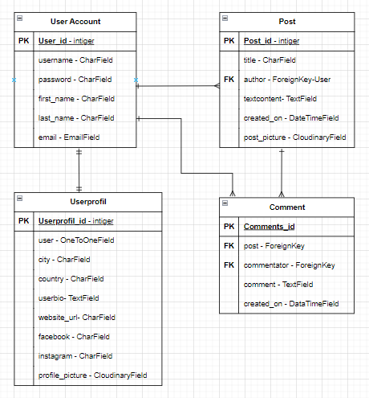

## Design
### Color
I used the website [Coolors](https://coolors.com/) to find colors that go together. 

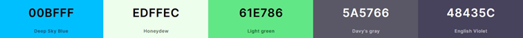

Finally, I checked the contrast again with [Contrast-grid](contrast-grid.eightshapes.com/). I added here the red and blue. These are bootstrap standart coolor which i used for the buttons. 

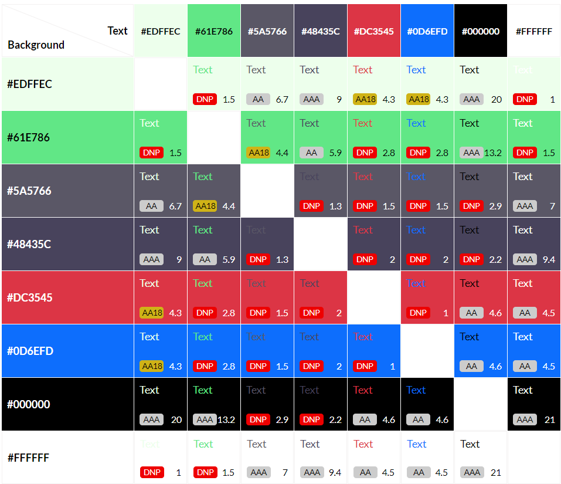

### Typography
The font in the project is PT Sans, a sans-serif googlefonds.

### Imagery
There is only one images in this project. The default userprofile picture is a picture from [Freepik](https://freepik.com/).
The uploading funtion is deactivated. The uploading function with cloudinary was not working shorly before the deployment. This function will be added in a later realize.

## Wireframe
To get an idea of the look of the individual web pages, wireframes were created in advance for each page.

Wireframe for the homepage:  
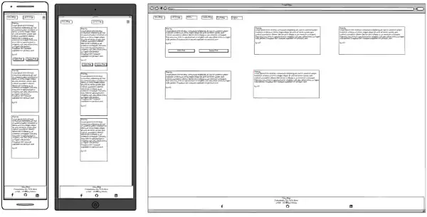

Wireframe for the register page:  
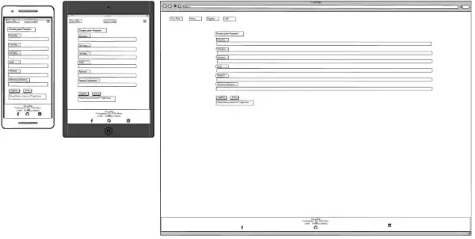

Wireframe for the login page:  
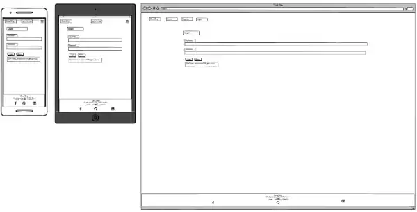

Wireframe for the create blog post page:  

Wireframe for the update blog post page:  
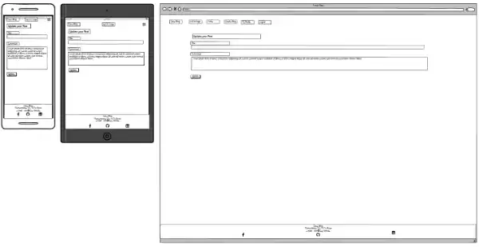

Wireframe for the delete blog post page:  
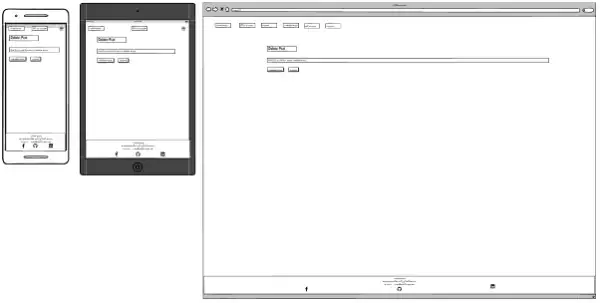

Wireframe for the detail blog post page:  
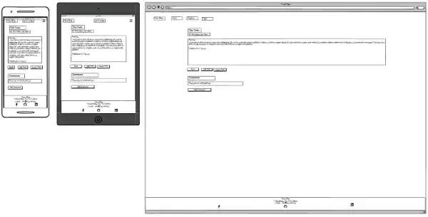

Wireframe for the create userprofile page:  
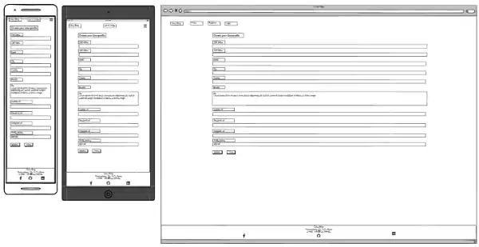

Wireframe for the update userprofile page:  
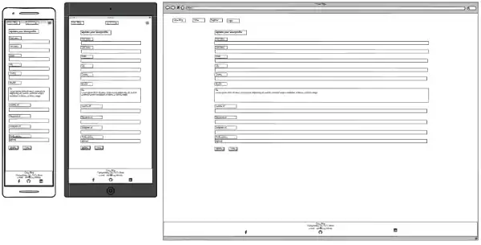

Wireframe for the userprofile page:  
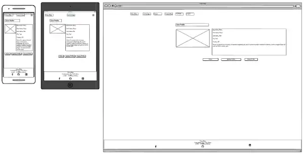

Wireframe for the delete userprofile page:  
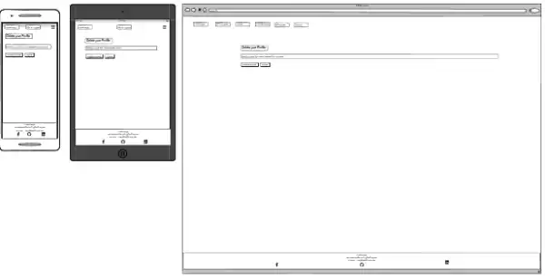

Wireframe for the comment overview on the blog detail page:  
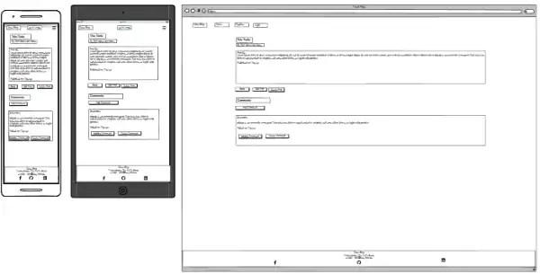

Wireframe for the create comment page:  
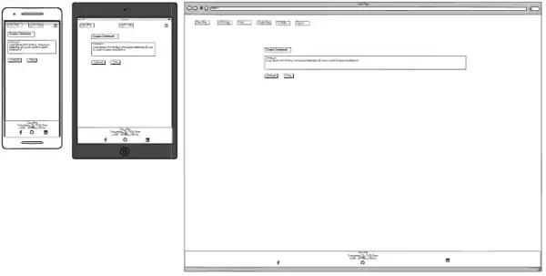

Wireframe for the update comment page:  

Wireframe for the delete comment page:  
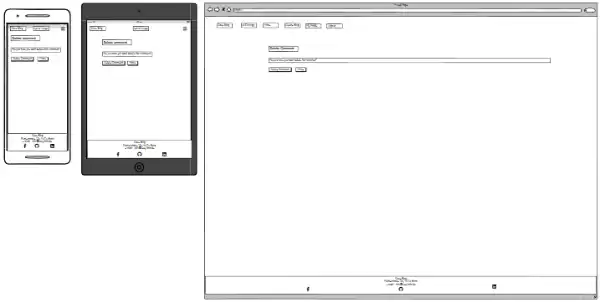

## Features
### Implemented Features
All pages of the project have a navigation bar, a main line and a footer. 
The footer always remains the same and does not change. It consists of an address and links to social networks. 
The navigation bar changes depending on whether and which user is logged in. The content of the main section changes depending on which page is currently being viewed. These are described in more detail below.

#### The homepage, overview page
If no user is logged in the navebar looks like this. On the top left there is the page name "Cave Blog". Next to it following links to the right to the Home, Register, and Login page.  
At the top of the main section there is a welcome text followed by a button that leads to the register page.  
After the welcome section, all blog posts are listed. On a large screen always 3 next to each other. On mobile devices, all posts are displayed one below the other. The title of each block post is a link that leads to the detailed view of the respective post. The block post text is followed by the author of the post. This is also clickable and leads to the user profile of the author. 
 
Homepage on big screens:  
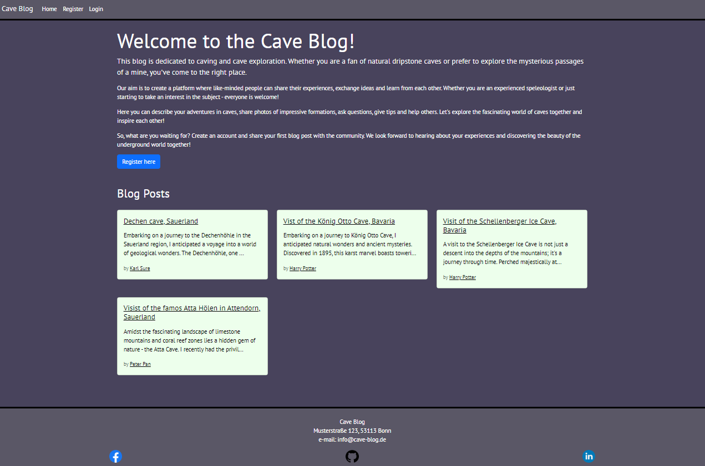

Homepage on small screens:  
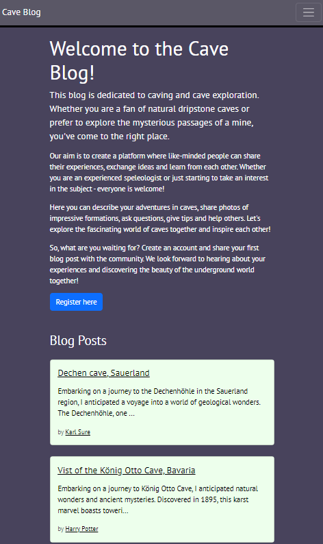
 
When a user is logged in, the navigation bar changes. Between the website name “Cave Blog” and the homepage link the username of the logged in user is displayed “Username is logged in”. The links to the register page and to the login have disappeared. Instead of these links, the link to the Create Blog Post page, Create User Profile Profile page and the link to the Logout page are located to the right of the Home link.  
The welcome text is also removed and the blog post overview follows directly. A button has appeared under the heading which leads to the Create Post page. If the author has already created a post, two buttons appear under the respective post. One leads to the Update page of the post, the other to the Delete page for the post. 
 
Homepage with a logged in user:  
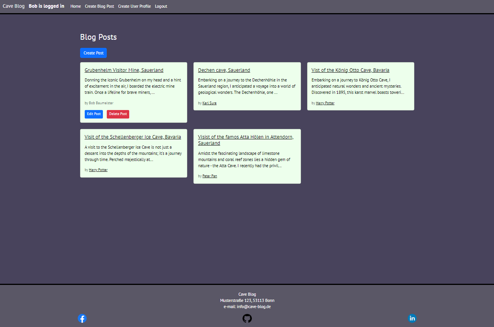

#### Register page
The register page is a form with fields for Username, Frist name, Last name, Email and Password and Password confirmation. There are buttons to submit the form and a button to return to the homepage if you do not want to register. There is also a link to the login page, if you already have an account, you can log in there.  
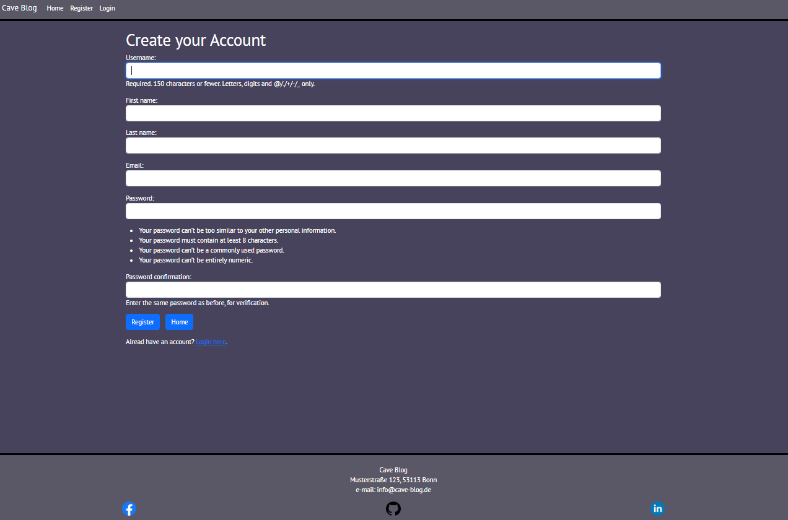

#### Login page
The login page is a form. It has a field for the user name and a password field. Then there is a button to log in and send the form. Next to it is a button that leads back to the homepage. Below the button is a link that leads to the register page if you do not have an account.  
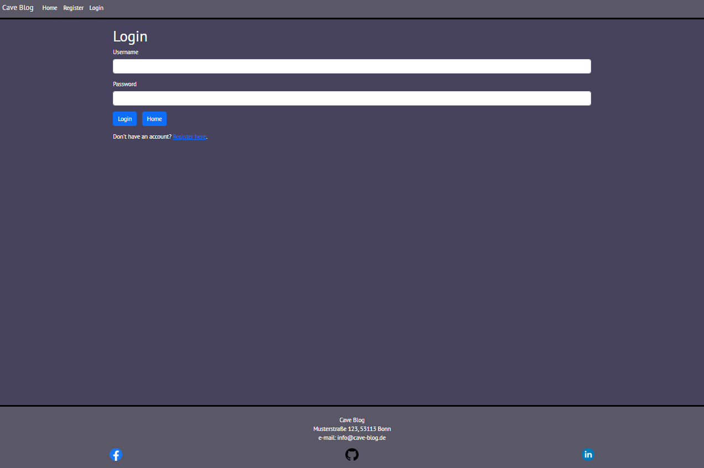

#### Userprofile
The Create your user profile page is a form. The first field is the city of the user. This is followed by the country and the user bio with a buzzer node text field. This is followed by a field for a website, a Facebook account and an Instagram account. Below this form is a button to submit the form, the "Create" button and a "Home" button that leads back to the homepage.  

Create your userprofile page:   
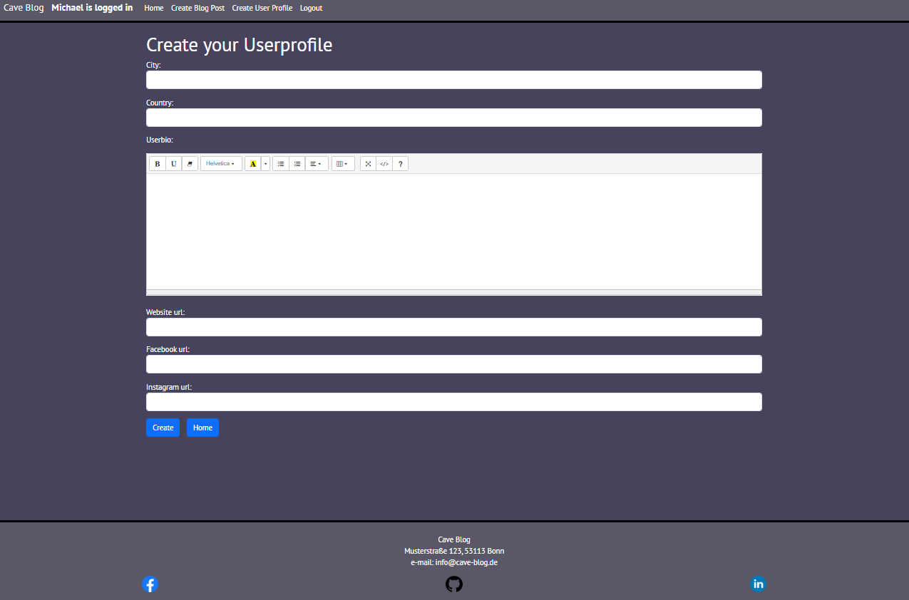

The My Profile page shows the user profile of the logged in user. The username, first name, last name, city, country, links to the website, Facebook and Instergram and an about me text of the user are displayed. On the lift of this content there is a placeholder for a userprofile picture. The feature to upload a personal picture will be added in the next realise.
Below this card there are links to the homepage, one to Update the User Profile page and to the delete the Profile. 
My profile page:   
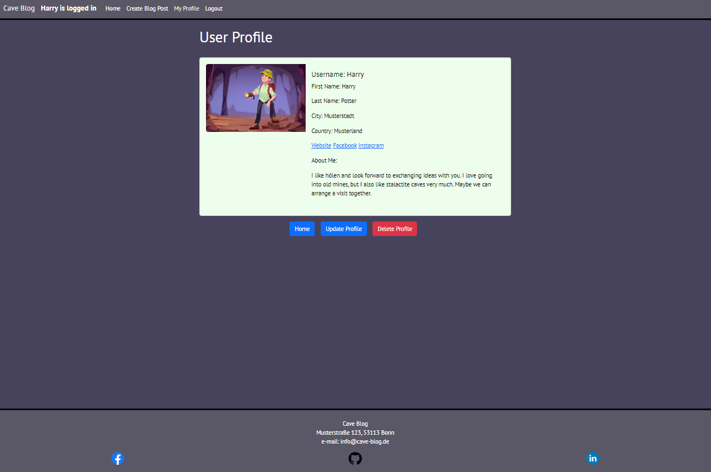

The delete your user profile contains a note. “Username” are you sure you want delete your Profile?" Below this note there is a Delete Profile button that deletes the profile and a button that takes you back to the homepage.  
Delete your Profile page:   
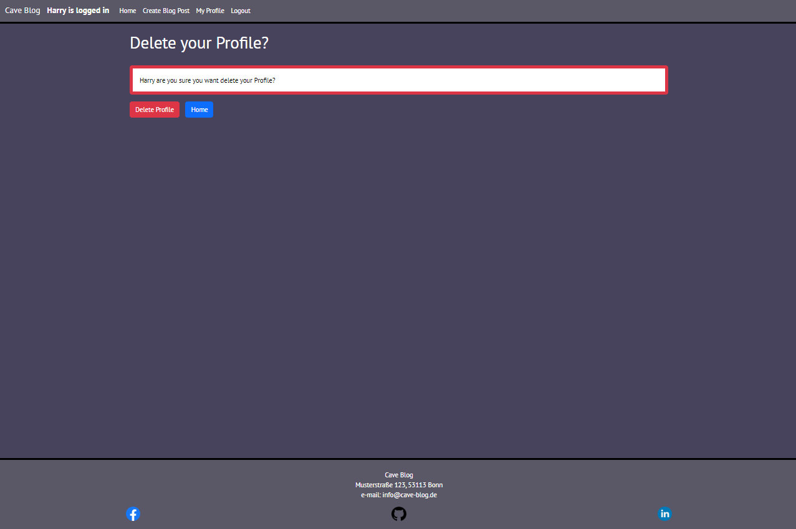

The Update your user profile page is the same form like the create your user profile page form. The form is fild with the existing data. The user now can edit and update it. Below the form there is one button to Update the form and next to it a button which leads back to the homepage.  
Delete your Profile page:   
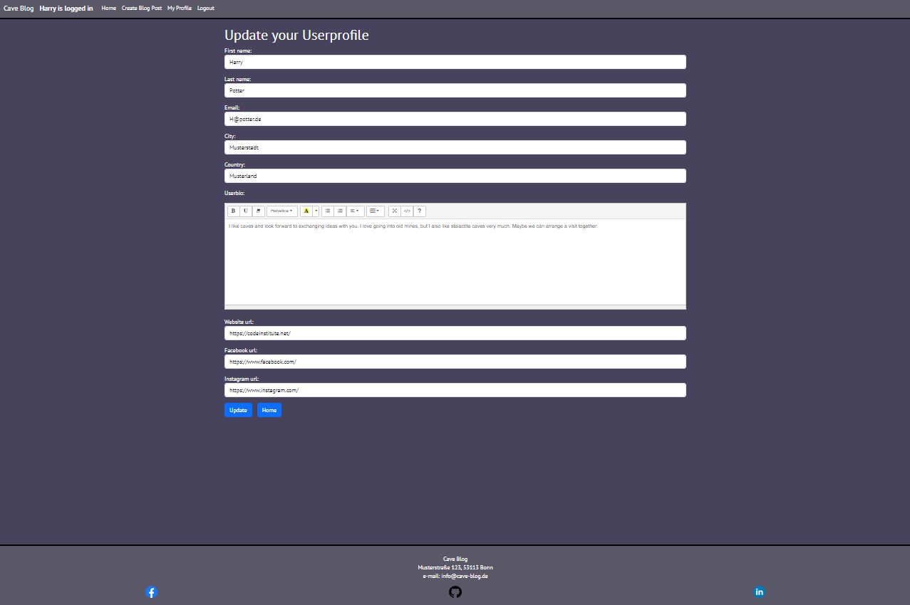

If a user looks at another user profile. This page is structured in exactly the same way as the user's own profile. On the left is the placeholder for the profile picture. The user name is at the top right. Then first name, last name, city, country and the About Me text. Below this card is a button back to the homepage. 
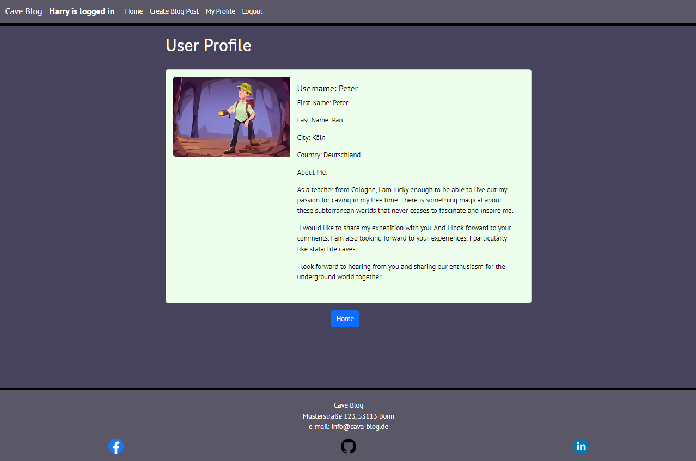

#### Blog posts and comments
The Create your Post page is a form consisting of a field for the title of the post. This is followed by a text content field with a summernode text editor for designing the text. The form fields are followed by two buttons. One to save the field and the other to return to the homepage.  

Create your post page:   
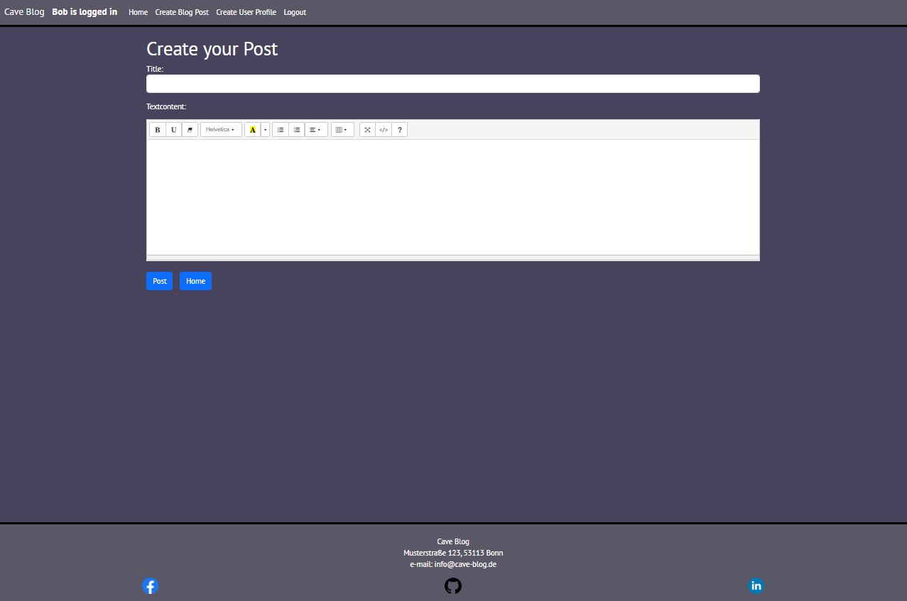

The detail page of Blog post is structured as follows. At the top is the title of the post. Below that is the author. This is a link and leads to the author's profile page, if the author has a profile page. Then you can read the text of the post and the publication date. Under this text there are 3 buttons. The first button leads back to the homepage. The second button opens the edit post page. Next to it is the delite post button which can be used to delete the post. The delete post and the update post button are only visible of the author ist loggied in who created the first in the first place.    
Below the post part is the comment section. If there are no comments yet, you can read the text “There are no comments yet.” followed by a button “Add Comment”. If there are comments, this text disappears and the existing comments are shown. 

Detail Blog post page with author logged in and without comments: 
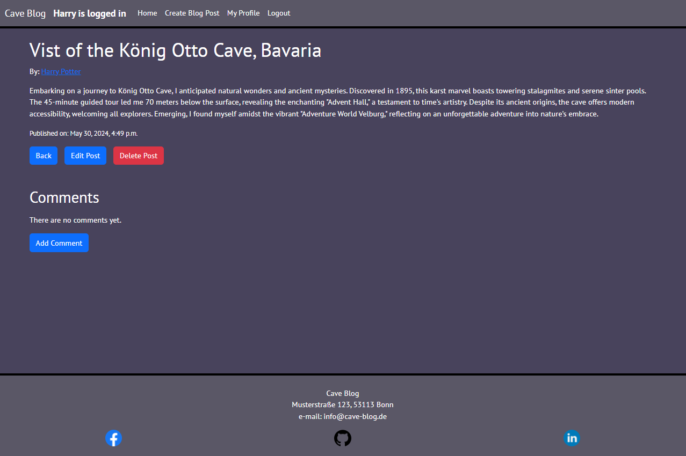

The buttons for updating and deleting the post are missing if the user who created the post is not logged in. If the author of the post does not have a profile page, the link at the author name of the post is also missing. If comments are available, they are listed below the Add Comments button. If the comment author of one of the listed comments is logged in, there are buttons below this comment. One button to update the comment and another to delete the comment. 

Detail Blog post page with comments: 
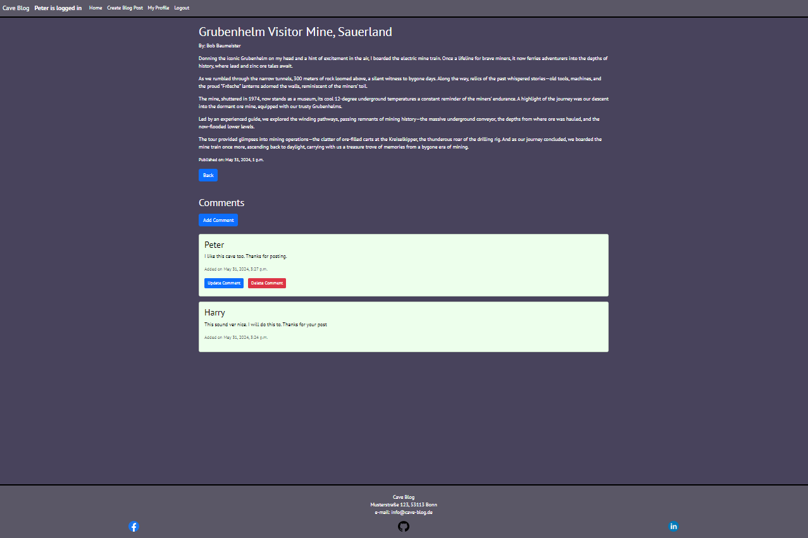

Delete blog post page: 
The blog post delete page looks similar to the user profile delete page. At the top is the tile of the post followed by the question “Are you sure you want delete this?”. After this question follows a button to delete the post and next to this button is a home button that leads back to the homepage. 
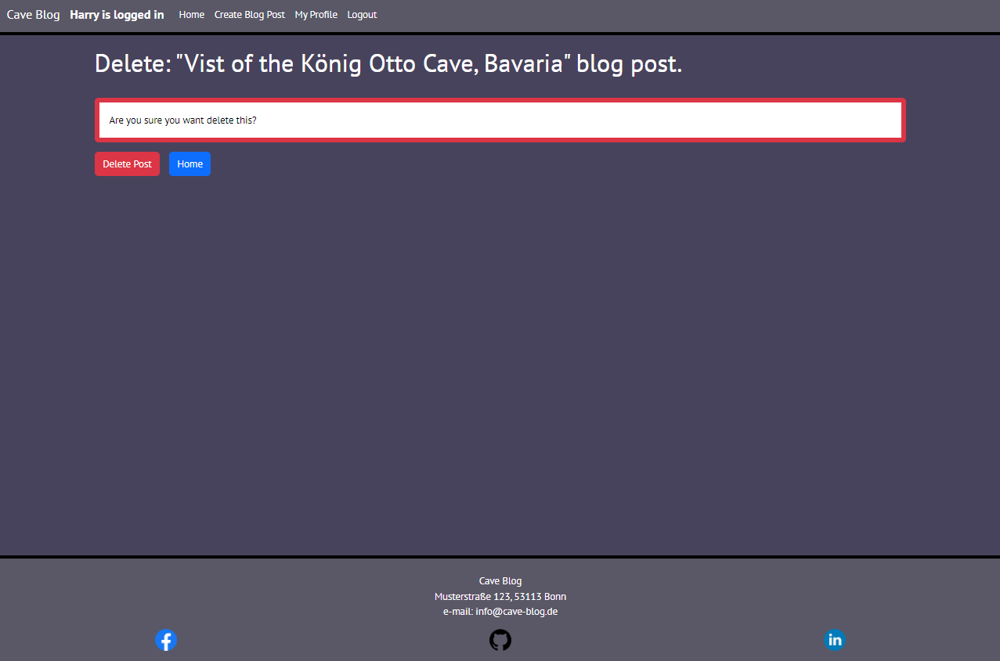

Delete comments page: 
The delete comment page also consists of a warning question below which there are two buttons. One button to delete the comment, the other to go back to the homepage.
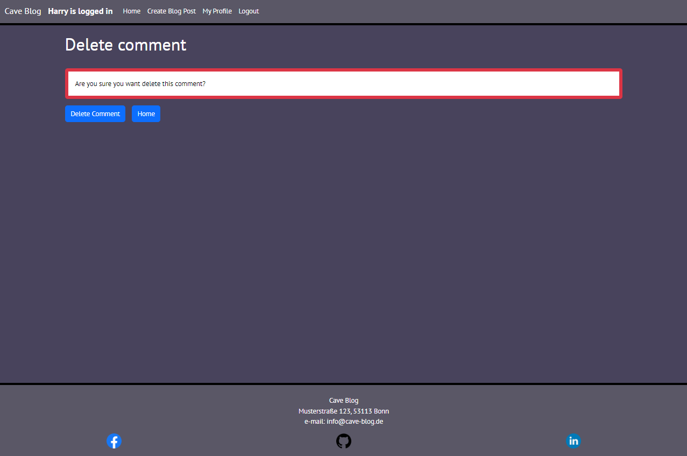

### Future Features
There are some features that are still possible and can be implemented in the future. These are already listed in the Aglie list and rated as “Will not have”.
* Password Change function.
* New Password, Forgotten Password function.
* Upload picture function in blog post.
* Upload picture function in user profile.
* Like function for blog posts.
* Categories function to sort blog posts into groups.

## Technologies used
### Languages and frameworks
HTML, CSS and Python languages were used in combination with the frameworks bootstrap and django.
Django was also customised with:
* Gunicorn - as WSGI (Web Server Gateway Interface) for running Python web applications.
* Summernote - WYSIWYG editor.
* Whitenoise - for storing static files.
* Cloudinary - as cloud to store no styic fieles (in the next release)

### Software and tools
Balsamiq - To create a wireframe.  
Draw-io - To create an ERD.  
Gitpod - To code the website.  
Git - For version control.  
Github - To store the website.  
Gitpod - As an integrated development environment to write the code.  
Heroku - To deploy the website.  
Google Fonts - All fonts used are from google fonts.  
Google Dev Tools, and Lighthouse - For troubleshooting testing and fixing bugs.  
Deepl - For translating text.  
Birme - To change the image to webp format and reducing the size of the images.  
Tabletomarkdown.com - Used to Create table for markdown out of excel cheats.  
ChatGPT - To create the content for blog posts and user profiles.  
Microsoft Excel - To pre create tables for the readme.  
PostGresSQl - to store the database information.  
CI Python Pep8 - to validate the Python code.  
W3C HTML Validator - to validate the HTML code.  
W3C CSS Validator -  to validate the CSS code.  
Wave Accessibility Tool - to test the accessibility.  

## Deployment
The project was coded with gipod and then deployed on heroku.

### Preparation for heroku depolyment
* The requirements.txt must be up to date - command pip3 freeze > requirements.txt.
* A procfile needs to be created for the configuration of the Heroku deployment as a Gunicorn web application.
* ALLOWED_HOSTS in settings.py must be set to ['app_name.heroku.com', 'localhost'] and static files must be configured.
* The environment variables in env.py, which are ignored in the repository, must be configured.

### Deploying on heroku
* Log in to your Heroku account.
* Click on the NEW button and then on "create new app".
* Choose a unique name for the app.
* Choose a region, Europe or United States.
* Click on "create app."
* Choose the deployment method (For this project GitHub was used).
* Search for the repository name on GitHub ("cave-blog").
* Connect the repository by clicking on Connect
* Click on the settings tab and then on reveal config vars.
* Input the required hidden variables
* Choose Node.js and Python as the designated buildpacks.
* Click on the Deployment tab
* Choose the main branch
* Deploy this project automated or manual (the project was deployed manually)
* Once a deployment has been successfully completed, a success message is displayed and a view button can be used to view the project in the browser

### Fork this repository
* Visit the GitHub repository.
* Click on the Fork button, located in the upper right-hand corner, next to the star button.

### Clone this repository
* Visit the GitHub repository.  [repository](https://https://github.com/SureDeveloping/cave-blog)
* Click the Code button, located in the top right, next to the about page.
* Choose between 'HTTPS', 'SSH', or 'GitHub CLI' based on your preferred method for cloning.
* Copy the URL.
* Open Git Bash.
* Choose the location where the cloned directory will be saved.
* Type git clone and paste the URL ($ git clone https://github.com/YOUR-USERNAME/YOUR-REPOSITORY)
* Press enter to create the local clone.

### Run this project locally
* Visit the GitHub repository.  [repository](https://https://github.com/SureDeveloping/cave-blog)
* Click the Code button, located in the top right, next to the about page.
* Click on download Zip.
* After downloding open the zip file and run it an editor.
* Create an env.py file for the environment variables.
* Install PostgreSQL on your machine and open the ports.
* Create a virtual environment and install the python modules in the pip file.
* Run python3 makemigrations, migrate and runserver

## Testing
The page was tested on different ways and different errors came to light. All tests are listes on a seperate page. Please follow the
[link.](./TESTING.md)

## Credits
### Content
The content of the website was created by Stephan Sure with the assistance of chat gpt. The content is all fictitious.

### Media
The the default image for the userprofile and the icons are from the website [Freepik](https://freepik.com/).

### Code
* CI codestar blog walkthrough - especially for setting up the project
* [CI Django Blog Webinarm](https://www.youtube.com/watch?v=YH--VobIA8c/) - tutorial related to the CI codestar blog walkthrough
* [Stack Overflow](https://stackoverflow.com/) -  in general for all questions about code.
* [Django Docs](https://www.djangoproject.com/) -  all questions about django.
* [Bootstrap Docs](https://getbootstrap.com/docs/5.3/getting-started/introduction/) - all questions about bootstrap.
* [CODEMY.com](https://www.youtube.com/playlist?list=PLCC34OHNcOtr025c1kHSPrnP18YPB-NFi/) - tutorial on how to create a blog website.
* [simpleisbetterthancomplex](https://simpleisbetterthancomplex.com/tutorial/2016/07/22/how-to-extend-django-user-model.html) - tutorial on how to extend django user model.
* [youtube Ssali Jonathan](https://www.youtube.com/watch?v=qwATSBwJj9A/) - tutorial on Django's In Built Authentication.
* [youtube Dee Mc](https://www.youtube.com/watch?v=sBjbty691eI&list=PLXuTq6OsqZjbCSfiLNb2f1FOs8viArjWy/) - tutorial on how to create a youtube blog.
* [youtube Dr. Daniel Soper](https://www.youtube.com/watch?v=lAtCySGDD48) - tutorial on how to create an ERD with draw.io
* [stackoverflow](https://stackoverflow.com/questions/39639264/django-highlight-current-page-in-navbar) - to make link in the navbar active 

### Acknowledgments
I like to thank the follow persons for the help during the project:
- My Code Institute mentor Spencer Barriball.
- The Tutor Support team at Code Institute.
- Slack pear groupe and and CI cohort.
- All the people who make their knowledge available for free on YouTube.

**This project is for educational use only and was created for the Code Institute course Full stack software development by Stephan Sure.**

