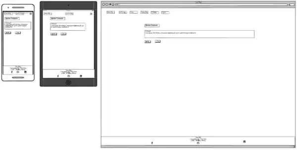

# ReadME - Project Instruction
Portfolio Project 4 – User SureDeveloping – Code Institute
## Introduction
"The website is a blog focused on caves. It's a place where cave enthusiasts can share their experiences by creating posts. Users can also comment on each other's posts. To get started, users need to set up a user accont. The blog is meant to be a space for like-minded individuals to connect, share experiences, and offer tips and advice for future cave visits. 
[Link to the deployed Project](https://cave-blog-5fd1224bbbc5.herokuapp.com/)

## Contents
[Contents](#contents) \
[User experience (UX)](#user-experience)\
    [Project goals](#target-audience)\
    [Target audience](#target-audience)\
    [User requirements and expectations](#user-requirements-and-expectations)\
[Epics and user stories](#user-story)\
    [Initial epics)](#initial-epics-for-an-mvp)\
    [Initial userstories )](#initial-userstories-for-an-mvp)\
[Agile approach](#agile-approach) \
[Design](#design) \
    [Color](#color) \
    [Typography](#typography) \
    [Imagery](#imagery) \
[Wireframe](#wireframe) \
[Entity relationship diagram](#entity-relationship-diagram) \
[Features](#features) \
    [Implemented features](#implemented-features) \
    [Future features](#futur-features) \
[Technologies used](#technologies-used) \
    [Languages and framework](#languages-and-framework) \
    [Database](#database) \
    [Technologies and tools](#technologies-and-tools) \
[Deployment](#deployment) \
    [Pre deployment](#pre-deployment) \
    [Deploying with heroku](#deploying-with-heroku) \
    [Fork the repository](#fork-the-repository) \
    [Clone the repository](#clone-the-repository) \
[Testing](#testing) \
    [Manual testing](#manual-testing) \
    [Tool testing](#tool-testing) \
    [Fixed bugs](#tool-testing) \
    [Known unfixed bugs](#known-unfixed-bugs) \
[Credits](#credits) \
    [Code materials used](#code-materials-used) \
    [Content on the website](#content-on-the-website) \
[Acknowledgments](#acknowledgments)

## User experience (UX)
### Project goal
The main goal of the project is it to offer an exchange opportunity for people who like caves and visit them. An easy and fun to use blog page with intuitive responsive Design. 

### Target audience
The main target group in are:
* People who like to visit caves and share their experiences.
* People who want to find out about caves they might want to visit.

### User requirements and expectations
As a first time user of the website, you want to:
* know what the website is about.
* read existing blog posts.
* register and create a new user account.
* login and logout.
* comment on existing blog posts.
* create a first blog post.

As a frequent user of the website, I want to:
* login and logout.
* Update existing blog posts and comments.
* Read new blog posts and comments.
* create a new blog posts.
* comment on a blog posts.

As operator of the website I want to:
* provide an easy to navigate and intuitive website.
* provide a feedback of all user inputs.
* provide an error free website.
* provide an a useful and fun app to many users.
* Provide the possibility to create, read, update and delete blogposts, comments and userprofiles.

## Epics and user stories
### Initial epics
* A blog post app with CRUD function. Create a post, update post, detail post and delete a post. 
* A welcome section on top of the Homepage, followed from all existing blog posts as an overview.
* Database and admin setup
* Register page with form
* Login page with form
* Navigation bar that shows the logged in user
* An account app with all user profiles with CRUD functionality
* A Comment function for the blog posts with CRUD functionality

### Initial user stories
* As a user, I want like to know what the website is about and made for
* As a user i want to see all Blog postes
* As a admin i want to have the overall control of the website
* As a user, I want to create my own account
* As a user, I want to login my own account
* As a user, I want to navigate through the subpages of the website when iam login
* As a user i want to write my post with a rich text editor for eaysy handling and styling
* As a user i want to create a blog post
* As a user i want to update a blog post
* As a user i want to read a blog posts
* As a user i want to delite a blog post
* As a user, I would like to protect my blog entries from unauthorized editing or deletion
* As a user I would like to be automatically noted as author when I create a new post editing or deletion
* As a user i want to create a comment
* As a user i want to update a comment
* As a user i want to read a comment
* As a user i want to delite a comment
* As a user i want to create a Userprofile
* As a user i want to update a  Userprofile
* As a user i want to read my Userprofile
* As a user i want to delite my Userprofile

## Agile approach
This application was developed by using an Agile apporoch. At the beginning, a list was created in which epics userstory and task were collected. These were evaluated using the Moscow Method, into three levels of importance: 'Must Have', 'Should Have', 'Cloud have#, and 'Will not have (wish to have)'.

| Epic                         | User Story                                                                                              | Acceptance Cretary                                                                                                                                                  | Tasks                                                                                                                                                                                    | Moscow                       |
| ---------------------------- | ------------------------------------------------------------------------------------------------------- | ------------------------------------------------------------------------------------------------------------------------------------------------------------------- | ---------------------------------------------------------------------------------------------------------------------------------------------------------------------------------------- | ---------------------------- |
| Overview page- About Section | As a user, I want like to know what the website is about and made for.                                  | AC1: Page with good readable Text on top that explanes the Project                                                                                                  | T1: Create an style the text section on top of the blog overview page                                                                                                                    | Could have                   |
| Overview page                | As a user i want to see all Blog postes                                                                 | AC1: All Created Blog Posts are visibel AC2: Page has a basic styling                                                                                            | T1: Create the  Post module T2: Create a Html page with the Text Content T3: Create the View T4: Create the url                                                                 | Should have                  |
| Database and admin setup     | As a admin i want to have the overall control of the website                                            | AC1:As Admin i can CRUD all content of the website and Login as a superuser in the django Admin dashboard                                                           | T1: Setup the Database T2: Setup the Admin function                                                                                                                                   | Must have                    |
| Register page with form      | As a user, I want to create my own account                                                              | AC1: Form which gives feedback whether the registartion was successful AC2: The form clearly states the username and password requirements                       | T1: Setup the Form             T2: Setup the Admin function                                T3: Create a Link to the Login Form                                                     | Must have                    |
| Login page with form         | As a user, I want to login my own account                                                               | AC 1: Form with username, password fild and a button to login  AC 2: User can see if he is loged in or not                                              | T1: Setup the Form             T2: Setup the Admin function                                T3: Create a Link to the Login Form                                                     | Must have                    |
| Navigation bar               | As a user, I want to navigate through the subpages of the website when iam login                        | AC1: Check if the user is loged in and change the nav bar AC2: Create a nav bar with all avalable items                                                          | T1: Create a Navigation bar T2: Create Link to all subpages                                                                                                                           | Should have                  |
|                              |                                                                                                         |                                                                                                                                                                     |                                                                                                                                                                                          |                              |
| Blog Post - text editor      | As a user i want to write my post with a rich text editor for eaysy handling and styling                | AC1: Rich Text Editor is working with blog posts                                                                                                                    | T1:Install a edithor    T2:Set it up for Bolog posts                                                                                                                                     | Could have                   |
| Blog Posts                   | As a user i want to create a blog post                                                                  | AC1: The user can create a Blog Post AC2: The page has a basic styling                                                                                           | T1: Create Post module T2: Create a Html page with the Text Content T3: Create the View T4: Create the url T5:  The user gets a success message T6: Create Post Form form | Must have                    |
| Blog Posts                   | As a user i want to update a blog post                                                                  | AC1: The user can  update a Blog Post AC2:The page has a basic styling AC3:The user gets a success message                                                    | T1: Create the  Post module T2: Create a Html page with the Text Content T3: Create the View T4: Create the url T5: Create post Update Form                                  | Must have                    |
| Blog Posts                   | As a user i want to read a blog posts                                                                   | AC1: The user can detile  read a Blog Post AC2:The page has a basic styling                                                                                      | T1: Create the  Post module T2: Create a Html page with the Text Content T3: Create the View T4: Create the url                                                                 | Must have                    |
| Blog Posts                   | As a user i want to delite a blog post                                                                  | AC1: The user can delite his Blog Post Ac2: The user gets a success message                                                                                      | T1: Create the  Post module T2: Create the View T3: Create the url                                                                                                                 | Must have                    |
| Blog Posts                   | As a user, I would like to protect my blog entries from unauthorized editing or deletion.               | AC1: Only the author of the post can edit it                                                                                                                        | T1: Create a verification before editing is allowed                                                                                                                                      | Should have                  |
| Blog Posts - auth            | As a user I would like to be automatically noted as author when I create a new post editing or deletion | AC1: The logedin user is also the author if a post is created                                                                                                       | T1: Set logged in user equal to author when a post is created                                                                                                                            | Should have                  |
|                              |                                                                                                         |                                                                                                                                                                     |                                                                                                                                                                                          |                              |
| Comment                      | As a user i want to create a comment                                                                    | AC1: A login in user can create a comment AC2: The comment form has a basix styling                                                                              | T1: Create the Comment Model T2: Create a View T3: Create a Urls T4 Create a html file                                                                                          | Must have                    |
| Comment                      | As a user i want to update a comment                                                                    | AC1: The user can  update a comment                                                                                                                                 | T1: Create a View T2: Create a Urls T3 Create a html file                                                                                                                          | Must have                    |
| Comment                      | As a user i want to read a  comment                                                                     | AC1: The user can read a comment                                                                                                                                    | T1: Create a View T2: Create a Urls T3 Create a html file                                                                                                                          | Must have                    |
| Comment                      | As a user i want to delite a  comment                                                                   | AC1: The user can delite a comment                                                                                                                                  | T1: Create a View T2: Create a Urls T3 Create a html file                                                                                                                          | Must have                    |
|                              |                                                                                                         |                                                                                                                                                                     |                                                                                                                                                                                          |                              |
| Userprofile                  | As a user i want to create a Userprofile                                                                | AC1: The user can create a Userprofile AC2: The page has a basix styling                                                                                         | T1: Create  user model extension, Profile Model T2: Create a View T3: Create a Urls T4 Create a html file T5 Create userprofile form                                         | Must have                    |
| Userprofile                  | As a user i want to update a  Userprofile                                                               | AC1: The user can  update a Userprofile AC2: The page has a basix styling                                                                                        | T1: Create  user model extension, Profile Model T2: Create a View T3: Create a Urls T4 Create a html file T5 Create userprofile form                                         | Must have                    |
| Userprofile                  | As a user i want to read my Userprofile                                                                 | AC1: The user can read a Userprofile AC2: The page has a basix styling                                                                                           | T1: Create  user model extension, Profile Model T2: Create a View T3: Create a Urls T4 Create a html file T5 Create userprofile form                                         | Must have                    |
| Userprofile                  | As a user i want to delite my Userprofile                                                               | AC1: The user can delite my Userprofile AC2: The page has a basic styling                                                                                        | T1: Create  user model extension, Profile Model T2: Create a View T3: Create a Urls T4 Create a html file T5 Create userprofile form                                         | Must have                    |
|                              |                                                                                                         |                                                                                                                                                                     |                                                                                                                                                                                          |                              |
| Custom Styling               | As a page operator I want to have a individual styled website.                                          | AC1: The websites has custom coloring                                                                                                                               | T1: Add custom coloring to all webpages                                                                                                                                                  | Clould have                  |
|                              |                                                                                                         |                                                                                                                                                                     |                                                                                                                                                                                          |                              |
| Database and admin setup     | As a Admin i want to have a custom made 404 error Page                                                  | AC1:Page with good readable Text on all divies                                                                                                                      | T1: Create a HTML Code with the Text Content T2: Style the page with CSS                                                                                                              | Will not have (wish to have) |
| Login page with a form       | As a user, I want to change my password                                                                 | AC1: Create Link to page where the user can change the Password AC2: Create the passwored change form                                                            | T1: Setup the form to change the password T2: Link the form to the login page                                                                                                         | Will not have (wish to have) |
| Login page with a form       | As a user, I want to get a new password if i have forgotten mine                                        | AC1: Create Link to page where the user can create the Password AC2: Create the passwored change form AC3: Check the user us autorised to change the password | T1: Setup the form to get a new password T2: Link the form to the login page T3: Validate if the user is authorised to change the password                                         | Will not have (wish to have) |
| Blog post                    | As a user, I want to upload pictures                                                                    | AC1: The user can upload pictures on there blog post                                                                                                                | T1: Install and Set up a host website for the images like cloudinary T2: Set up the module and form with this function                                                                   | Will not have (wish to have) |
| Userprofile                  | As a user, I want to upload a profile image                                                             | AC1: The user can upload pictures on there profile                                                                                                                  | T1: Install and Set up a host website for the images like cloudinary T2: Set up the module and form with this function                                                                | Will not have (wish to have) |
| Like Blog post               | As a user, I want to add like to blog posts                                                             | AC1: The user can clink on a symbole and a like is counted up AC2: Everx user can just add one Like                                                              | T1: Add a module for the like function T2: Add a view for the like function T3: Add url and code to the htmls templates                                                            | Will not have (wish to have) |
| Categorys                    | As a user, I want to filter the post by different categorys                                             | AC1: To Categorys are created, one for artificial and natural cave AC2: The user can filter via a menue to see just one category of caves.                       | T1: Add a module for the category function T2: Add a view for the category function T3: Add url and code to the htmls templates                                                    | Will not have (wish to have) |
| Categorys                    | As a user, I want to sort my post in different categorys                                                | AC1: In the create, update post menue i can add a category to the post                                                                                              | T1: Add the category to the blog form.                                                                                                                                                   | Will not have (wish to have) |

All user stories, except for 'Will not have (wish to have)', were transferred to a GitHub Projects [kanban bord](https://github.com/users/SureDeveloping/projects/4/views/1/). Here, the development process was then monitored during the creation of the individual increments. The features were prioritized based on their importance to functionality and interdependencies.

## Design
### Color scheme
I used the website [Coolors](https://coolors.com/) to find colors that go together. 

Finally, I checked the contrast again with [Contrast-grid](contrast-grid.eightshapes.com/). I added here the red and blue. These are bootstrap standart coolor which i used for the buttons. 

### Typography
Tho font in the project is PT Sans, a sans-serif googlefonds.

### Imagery
There is only one images in this project. The default userprofile picture is a picture from [Freepik](https://freepik.com/).
The uplosding funtion is deactivated. The uploading function with cloudinary was not working shorly before the deployment. This function will be added in a later realize.

### Wireframe
To get an idea of the look of the individual web pages, wireframes were created in advance for each page.

Wireframe for the homepage:

Wireframe for the register page:

Wireframe for the login page:

Wireframe for the create blog post page:

Wireframe for the update blog post page:

Wireframe for the delete blog post page:

Wireframe for the detail blog post page:

Wireframe for the create userprofile page:

Wireframe for the update userprofile page:

Wireframe for the userprofile page:

Wireframe for the delete userprofile page:

Wireframe for the comment overview on the blog detail page:

Wireframe for the create comment page:

Wireframe for the update comment page:

Wireframe for the delete comment page:

### Entity Relationship Diagram
To illustrate the dependencies of the individual functions of the models, an entity relationship diagram was created. This facilitates the work in the creation process.

### Features
The website is a Blog about caves. 

### Accessibility
To ensure Accessibility the following things were done:
- I used semantic HTML.
- I used descriptive alt attributes for images.
- I provided information for screen readers.
- I used good color contrast and a tested color palette.

## Technologies used
### Languages used
HTML, CSS and Java Script were used for this project.
### Software used
Balsamiq - To create a wireframe.  
Gitpod - To code the website.  
Git - For version control.  
Github - To store and deploy the website.  
Google Fonts - All fonts used are from google fonts.  
gauger.io/fonticon - To create a favicon.  
Google Dev Tools, and Lighthouse - For troubleshooting testing and fixing bugs.  
Deepl - For translating text.  
Birme - To change the image to webp format and reducing the size of the images.  
Am I Responsive? - To check if the page is responsive.  
## Deployment
The project was coded with gipod and then deployed on heroku. That is how the deployment was done:

## Testing
The page was tested on different ways and different errors came to light. All tests are listes on a seperate page. Please follow the link.
 [Link to the testing page](https://cave-blog-5fd1224bbbc5.herokuapp.com/)

### Solved bugs
- 
### Known unsolved bugs
- There are ...
## Credits
### Code used
- I used th

### Content on the website
The content of this project was written by Stephan Sure und the held of the ai toll of chatgpt.
### Learning materials
- All content from nnline course in "Full Stack Software Developmen" especially videos about Portfolio Project 2 and ReadME from Code Instituet
- https://www.youtube.com/watch?v=40vLxYUJiQY&list=PL_7334VduOHvzZYlgy_0kZLcic2NINCUt&index=6 - Video about the Profolio Project 2
- https://www.youtube.com/watch?v=U9VF-4euyRo&t=831s - Video about css and clamp function
- https://www.youtube.com/watch?v=eHPLTDOAggc - To lern how to make the buttons work
- https://www.youtube.com/watch?v=riDzcEQbX6k - How to bulid a quizz with java script
- https://www.youtube.com/playlist?list=PLB6wlEeCDJ5Yyh6P2N6Q_9JijB6v4UejF  - How to bulid a quizz with java script
- https://www.youtube.com/watch?v=PBcqGxrr9g8 - How to bulid a quizz with java script
- https://developer.mozilla.org/en-US/docs/Web/API/setTimeout - Timeout function
- https://www.w3schools.com/jsref/event_onclick.asp  - To lern how to make the buttons work
- https://www.youtube.com/watch?v=xVMkFJZhZYU&t=283s - To lern how to make the buttons work
- https://werner-zenk.de/javascript/html-button_ueber_javascript_eine_funktion_zuweisen.php - To lern how to make the buttons work
- https://www.youtube.com/watch?v=P6UgYq3J3Qs - To learn more about position absolut and relative
- https://www.youtube.com/shorts/9cSL5dP4rgM - To learn more about position absolut and relative
- https://stackoverflow.com/
- https://www.w3schools.com/css/
- geekforgeeks
- W3Schools
### Acknowledgments
I like to thank the follow persons for the help during the project:
- My Code Institute mentor Spencer Barriball.
- The Tutor Support team at Code Institute.
- Slack pear groupe especially James Evans.
- All the people who make their knowledge available for free on YouTube.

**This project is for educational use only and was created for the Code Institute course Full stack software development by Stephan Sure.**

