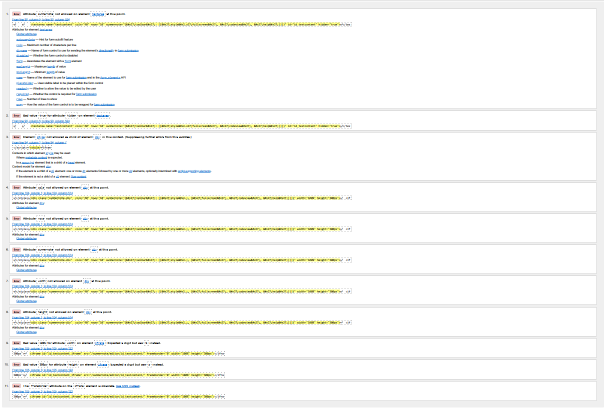
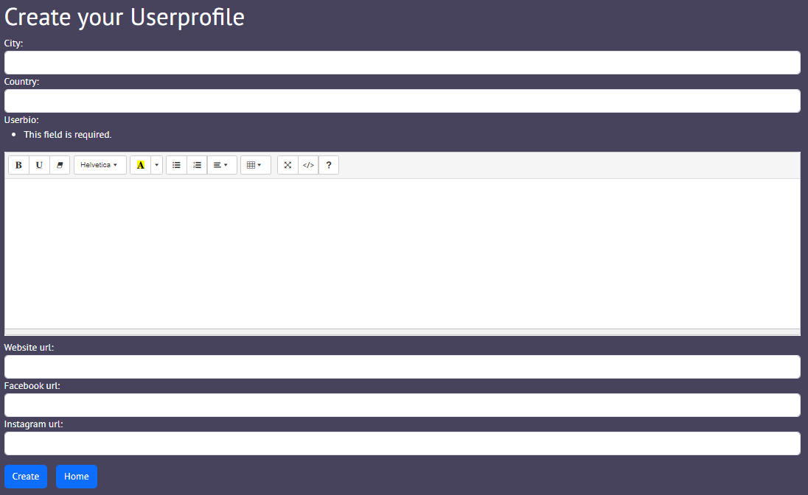

Link back to [README.md](/README.md)
  
# Testing

- [Code validation](#code-validation)
    - [HTML validation](#html-validation)
    - [CSS validation](#css-validation)
    - [Python validation](#python-validation)
    - [Lighthouse test](#lighthouse-test)
    - [Wave accessibility evaluation](#wave-accessibility-evaluation)
- [Manual testing](#manual-testing)
    - [User input Validation](#user-input-validation)
    - [Browser compatibility](#browser-compatibility)  
    - [Responsiveness test](#responsiveness-test)
    - [User story testing](#user-story-testing)
- [Bugs](#bugs)
    - [Fixed known bugs](#fixed-known-bugs)
    - [Unfixed kown bugs](#Unfixed-kown-bugs)

## Code validation
### HTML validation
The individual pages have been checked with the W3C validar. All errors could be fixed except for the pages where Sommernode was used. On these pages 11 errors were found that Sommernode causes. It is an external source over which I have no control. To fix these errors in the future it would be possible to find another text editor that does not cause errors.

| page                     | validator                                                                                                                                              | errors | result |
| ------------------------ | ------------------------------------------------------------------------------------------------------------------------------------------------------ | ------ | ------ |
| Homepage - index.html    | 

Homepage - index.html

                              | 0      | pass   |
| register.html            | 

register.html

                                   | 0      | pass   |
| login.html               | 

login.html

                                         | 0      | pass   |
| blog_post_create.html    | 

blog_post_create.html

                   | 11     | pass   |
|                          | 

blog_post_create.html-error

       |        |        |
| blog_post_update.html    | 

blog_post_update.html

                   | 11     | pass   |
|                          | 

blog_post_update.html-error

       |        |        |
| blog_post_detail.html    | 

blog_post_detail.html

                   | 0      | pass   |
| blog_post_delete.html    | 

blog_post_delete.html

                   | 0      | pass   |
| user_profile_create.html | 

user_profile_create.html

             | 11     | pass   |
|                          | 

user_profile_create.html-error

 |        |        |
| user_profile_update.html | 

user_profile_update.html

             | 11     | pass   |
|                          | 

user_profile_update.html-error

 |        |        |
| user_profile_detail.html | 

user_profile_detail.html

             | 0      | pass   |
| user_profile_delete.html | 

user_profile_delete.html

             | 0      | pass   |
| comment_create.html      | 

comment_create.html

                       | 0      | pass   |
| comment_update.html      | 

comment_update.html

                       | 0      | pass   |
| comment_delete.html      | 

comment_delete.html

                       | 0      | pass   |

### CSS Validator:
The base.cc file was tested using W3C Validator. No errors occurred.
[W3C validator](https://validator.w3.org/)  
Here is the test result: 
[W3C validator - test result](docs/readme_images/css-validator/css-validation.png)

### Python Validation
All python files created were tested with the CI Python Linter. The errors detected have been eliminated, so that all files are now error-free.
[CI Python Linter](https://pep8ci.herokuapp.com/)

| page                     | validator                                                                                                                         | errors | result |
| ------------------------ | --------------------------------------------------------------------------------------------------------------------------------- | ------ | ------ |
| account app - admin.py   | 

account app - admin.py

     | 0      | pass   |
| account  app - forms.py  | 

account  app - forms.py

   | 0      | pass   |
| account  app - models.py | 

account  app - models.py

 | 0      | pass   |
| account  app - urls.py   | 

account  app - urls.py

     | 0      | pass   |
| account  app - view.py   | 

account  app - view.py

    | 0      | pass   |
| blog app -admin.py       | 

blog app -admin.py

             | 0      | pass   |
| blog app -forms.py       | 

blog app -forms.py

            | 0      | pass   |
| blog app - models.py     | 

blog app - models.py

         | 0      | pass   |
| blog app -urls.py        | 

blog app -urls.py

              | 0      | pass   |
| blog app -view.py        | 

blog app -view.py

             | 0      | pass   |
| caveblog - settings.py   | 

caveblog - settings.py

          | 0      | pass   |
| caveblog - urls.py       | 

caveblog - urls.py

                   | 0      | pass   |

### Lighthouse test
Performance, accessibility, best practices and seo were tested using [lighthouse](https://developer.chrome.com/docs/lighthouse/overview/)  
Overall, good values were achieved in the lighthouse test. However, it can be seen that the performance of the pages where Summernode was used is significantly worse than the pages without Summernode. On the pages with Summernode the value is between 68 and 71, on the other pages the worst value is 88. For this reason it is worth testing a different text editor in the future.  
With a blog, I don't have much influence on the content and therefore on the SEO value. The worst value is 83, which is still good, but it is difficult to improve it if you have little influence on the content. 
The values for accessibility and best practices are all in the very good range. 

| page                     | performance | accessibility | best practices | seo | screenshot                                                                                                                             | result |
| ------------------------ | ----------- | ------------- | -------------- | --- | -------------------------------------------------------------------------------------------------------------------------------------- | ------ |
| Homepage - index.html    | 90          | 97            | 96             | 92  | 

Homepage - index.html

                  | pass   |
| register.html            | 96          | 95            | 96             | 92  | 

register.html

                       | pass   |
| login.html               | 94          | 94            | 96             | 92  | 

login.html

                             | pass   |
| blog_post_create.html    | 70          | 94            | 96             | 83  | 

blog_post_create.html

       | pass   |
| blog_post_update.html    | 71          | 94            | 96             | 83  | 

blog_post_update.html

       | pass   |
| blog_post_detail.html    | 88          | 100           | 96             | 83  | 

blog_post_detail.html

       | pass   |
| blog_post_delete.html    | 97          | 100           | 96             | 83  | 

blog_post_delete.html

                | pass   |
| user_profile_create.html | 68          | 94            | 96             | 83  | 

user_profile_create.html

 | pass   |
| user_profile_update.html | 69          | 94            | 96             | 83  | 

user_profile_update.html

 | pass   |
| user_profile_detail.html | 95          | 97            | 96             | 83  | 

user_profile_detail.html

 | pass   |
| user_profile_delete.html | 94          | 100           | 96             | 83  | 

user_profile_delete.html

 | pass   |
| comment_create.html      | 95          | 100           | 96             | 83  | 

comment_create.html

           | pass   |
| comment_update.html      | 96          | 100           | 96             | 83  | 

comment_update.html

           | pass   |
| comment_delete.html      | 88          | 100           | 96             | 83  | 

comment_delete.html

           | pass   |

### Wave accessibility evaluation
WAVE® is a test to ensure that web content is more accessible to individuals with disabilities.
The website passes the test, no errors appear. [Link to Wave](https://wave.webaim.org/)  

Here is the test result:
[Wave - test result](docs/readme_images/wave/wave-test.png)

## Manual testing
### User input Validation

#### Forms
The formulas on the website have been tested to ensure that they work properly. Function of forwarding and notifications.

| Feature               | Action               | Expected Outcome                                                                                                                                                 | Screenshots                                                                                                               | result |
| --------------------- | -------------------- | ---------------------------------------------------------------------------------------------------------------------------------------------------------------- | ------------------------------------------------------------------------------------------------------------------------- | ------ |
| Registration Form     | Submit form          |   User receives confirmation message and is redirected to the login page.Warnings are issued accordingly for unauthorized entries.                               | 

Registration Form

           | pass   |
|                       |                      |                                                                                                                                                                  | 

Registration Form

           |        |
|                       |                      |                                                                                                                                                                  | 

Registration Form

           |        |
| Login Form            | Login with user data | User can log in and is redirected to the homepage. Warnings are issued accordingly for unauthorized entries.                                                     | 

Registration Form

              | pass   |
|                       |                      |                                                                                                                                                                  | 

Registration Form

              |        |
| Create Blog Post Form | Create post          | User can create a Blog Post and re redirected to the deatil view of the post. Warnings are issued accordingly for empty field                                    | 

Registration Form

   | pass   |
| Update Blog Post Form | Update post          | User can update a Blog Post and is redirected to the deatil view of the post. Warnings are issued accordingly for empty field                                    | 

Registration Form

   | pass   |
| Create Comment Form   | Create comment       | User can create a comment and is redirected to the deatil view of the post. Warnings are issued accordingly for empty field                                      | 

Registration Form

   | pass   |
| Update Comment Form   | Update comment       | User can update a comment and is redirected to the deatil view of the post. Warnings are issued accordingly for empty field                                      | 

Registration Form

     | pass   |
| Create Userprofile    | Create userprofile   | User can create a userprofile and is redirected to the deatil view of the profile. Warnings are issued if the about me field is empty. The rest are not required | 

Registration Form

 | pass   |
| Update Userprofile    | Update userprofile   | User can update a userprofile and is redirected to the deatil view of the profile. Warnings are issued if the about me field is empty. The rest are not required | 

Registration Form

 | pass   |

#### Buttons and links
All links and buttons on the website have been tested for proper function. 

| Feature                                                                                                                                       | page                    | User Input | Expected Outcome                                                                                                                                                                                                                                                                                                                                                                                                              | result |
| --------------------------------------------------------------------------------------------------------------------------------------------- | ----------------------- | ---------- | ----------------------------------------------------------------------------------------------------------------------------------------------------------------------------------------------------------------------------------------------------------------------------------------------------------------------------------------------------------------------------------------------------------------------------- | ------ |
| Navigation bar links                                                                                                                          | All                     | Click      | Clicking on the navigation links will open the desired pages. The active page is highlighted in the navigation bar if there is a link to the currently open page. The hover effect also indicates that the links are clickable. The links in the navbar change depending on whether a user is logged in or not and whether they have a user profile or not. The user name is also displayed in the navbar if he is logged in. | pass   |
| Register here button on the homepage                                                                                                          | Homepage                | Click      | The button redirects to the register page                                                                                                                                                                                                                                                                                                                                                                                     | pass   |
| Social links in the footer                                                                                                                    | All                     | Click      | The links work and open the respective website in a new window                                                                                                                                                                                                                                                                                                                                                                | pass   |
| Home button under the register form                                                                                                           | register                | Click      | The button redirects to the homepage.                                                                                                                                                                                                                                                                                                                                                                                         | pass   |
| Link under the Buttons on the register form                                                                                                   | register                | Click      | The link redirects to the login page.                                                                                                                                                                                                                                                                                                                                                                                         | pass   |
| Home button under the loginform                                                                                                               | login                   | Click      | The button redirects to the homepage.                                                                                                                                                                                                                                                                                                                                                                                         | pass   |
| Link under the Buttons on the login form                                                                                                      | login                   | Click      | The link redirects to the register page.                                                                                                                                                                                                                                                                                                                                                                                      | pass   |
| Link in the title of a blog post on the homepage                                                                                              | homepage                | Click      | Redirects to the respective detail page of the blog.                                                                                                                                                                                                                                                                                                                                                                          | pass   |
| Link in author name of a blog post on the Homepage. Links are visible if the user is logged in with an account and the author has an profile. | homepage                | Click      | Redirects to the respective userprofile page.                                                                                                                                                                                                                                                                                                                                                                                 | pass   |
| Button create post under the headline of the homepage if a user is logged in.                                                                 | homepage                | Click      | Redirects to the create post page                                                                                                                                                                                                                                                                                                                                                                                             | pass   |
| Edit post button is visible if the loggind in user is the author of a post on the homepage. (Homepage)                                        | homepage                | Click      | Redirects to the update Post page                                                                                                                                                                                                                                                                                                                                                                                             | pass   |
| Delete post button is visible if the loggind in user is the author of a post on the homepage. (Homepage)                                      | homepage                | Click      | Redirects to the delete Post page                                                                                                                                                                                                                                                                                                                                                                                             | pass   |
| Home button on the create blog post page                                                                                                      | Create blok post        | Click      | Redirects to the homepage                                                                                                                                                                                                                                                                                                                                                                                                     | pass   |
| The delete post button on the delete post page                                                                                                | Delete post page        | Click      | The post is deleted and the user is redirected to the homepage                                                                                                                                                                                                                                                                                                                                                                | pass   |
| The home button on the delete post page                                                                                                       | Delete post page        | Click      | Redirects to the homepage                                                                                                                                                                                                                                                                                                                                                                                                     | pass   |
| The home button under the userprofile detail page (my profile page)                                                                           | Userprofile detail page | Click      | Redirects to the homepage                                                                                                                                                                                                                                                                                                                                                                                                     | pass   |
| The update profile button under the userprofile details.(my profile page)                                                                     | Userprofile detail page | Click      | Redirects to the update userprofile page                                                                                                                                                                                                                                                                                                                                                                                      | pass   |
| The delete profile button under the userprofile details.(my profile page)                                                                     | Userprofile detail page | Click      | Redirects to the delete userprofile page                                                                                                                                                                                                                                                                                                                                                                                      | pass   |
| The home button under the userprofile delete page                                                                                             | Userprofile delete page | Click      | Redirects to the homepage                                                                                                                                                                                                                                                                                                                                                                                                     | pass   |
| The delete button under the userprofile delete page                                                                                           | Userprofile delete page | Click      | Redirects deletes the userprofile and the user is redirected to the homepage                                                                                                                                                                                                                                                                                                                                                  | pass   |
| The back button on the blog post detail page.                                                                                                 | Blog post detail        | Click      | Redirects to the homepage                                                                                                                                                                                                                                                                                                                                                                                                     | pass   |
| The edith post button on the blog post detail page,  is visible if the loggind in user is the author                                          | Blog post detail        | Click      | Redirects to the update blog post page                                                                                                                                                                                                                                                                                                                                                                                        | pass   |
| The delete post button on the blog post detail page is visible if the loggind in user is the author                                           | Blog post detail        | Click      | Redirects to the delete blog post page                                                                                                                                                                                                                                                                                                                                                                                        | pass   |
| The add comment button on the blog post detail page.                                                                                          | Blog post detail        | Click      | Redirects to the comment create page.                                                                                                                                                                                                                                                                                                                                                                                         | pass   |
| The update comment button on the blog post detail page, if there is already a comment and the author of the comment is logged in              | Blog post detail        | Click      | Redirects to the comment update page.                                                                                                                                                                                                                                                                                                                                                                                         | pass   |
| The delete comment button on the blog post detail page, if there is already a comment and the author of the comment is logged in              | Blog post detail        | Click      | Redirects to the comment delete page.                                                                                                                                                                                                                                                                                                                                                                                         | pass   |
| The link othe the author if the auther has a userprofile on the blog post detail page                                                         | Blog post detail        | Click      | Redirects to the userprofile of the author of the blog post                                                                                                                                                                                                                                                                                                                                                                   | pass   |
| The delete comment button on the delete comment page                                                                                          | delete comment page     | Click      | Redirects to the homepage                                                                                                                                                                                                                                                                                                                                                                                                     | pass   |
| The home button on the delete comment page                                                                                                    | delete comment page     | Click      | Redirects deletes the userprofile and the user is redirected to the homepage                                                                                                                                                                                                                                                                                                                                                  | pass   |
| The home button on the create user profile page                                                                                               | Create userprofile      | Click      | Redirects to the homepage                                                                                                                                                                                                                                                                                                                                                                                                     | pass   |
| The home button on the update user profile page                                                                                               | Update userprofile      | Click      | Redirects to the homepage                                                                                                                                                                                                                                                                                                                                                                                                     | pass   |

### Browser compatibility
The blog website was tested on 3 different browsers to ensure cross-browser compatibility. No errors were detected.

| Browser | Issues Found | result |
| ------- | ------------ | ------ |
| Chrome  | None         | Pass   |
| Firefox | None         | Pass   |
| Edge    | None         | Pass   |

### Responsiveness test
Via chrome Dev tool the resposivness for different devices was tested. All tested sites look good on the respective devices and work satisfactorily.

| page                     | iPhone SE, 375px wide | iPad Mini, 768px wide | Nest Hub Max,1280px wide |
| ------------------------ | --------------------- | --------------------- | ------------------------ |
| Homepage - index.html    | pass                  | Pass                  | Pass                     |
| register.html            | pass                  | Pass                  | Pass                     |
| login.html               | pass                  | Pass                  | Pass                     |
| blog_post_create.html    | pass                  | Pass                  | Pass                     |
| blog_post_update.html    | pass                  | Pass                  | Pass                     |
| blog_post_detail.html    | pass                  | Pass                  | Pass                     |
| blog_post_delete.html    | pass                  | Pass                  | Pass                     |
| user_profile_create.html | pass                  | Pass                  | Pass                     |
| user_profile_update.html | pass                  | Pass                  | Pass                     |
| user_profile_detail.html | pass                  | Pass                  | Pass                     |
| user_profile_delete.html | pass                  | Pass                  | Pass                     |
| comment_create.html      | pass                  | Pass                  | Pass                     |
| comment_update.html      | pass                  | Pass                  | Pass                     |
| comment_delete.html      | pass                  | Pass                  | Pass                     |

### User story testing

|    | User Story                                                                                              | Acceptance Cretary                                                                                                                            | result |
| -- | ------------------------------------------------------------------------------------------------------- | --------------------------------------------------------------------------------------------------------------------------------------------- | ------ |
| 1  | As a user, I want like to know what the website is about and made for.                                  | AC1: Page with good readable Text on top that explanes the Project                                                                            | pass   |
| 2  | As a user i want to see all Blog postes                                                                 | AC1: All Created Blog Posts are visibel AC2: Page has a basic styling                                                                      | pass   |
| 3  | As a admin i want to have the overall control of the website                                            | AC1:As Admin i can CRUD all content of the website and Login as a superuser in the django Admin dashboard                                     | pass   |
| 4  | As a user, I want to create my own account                                                              | AC1: Form which gives feedback whether the registartion was successful AC2: The form clearly states the username and password requirements | pass   |
| 5  | As a user, I want to login in my own account                                                            | AC 1: Form with username, password field and a button to login AC 2: User can see if he is loged in or not                           | pass   |
| 6  | As a user, I want to navigate through the subpages of the website when iam login                        | AC1: Check if the user is loged in and change the nav bar AC2: Create a nav bar with all avalable items                                    | pass   |
| 7  | As a user i want to write my post with a rich text editor for eaysy handling and styling                | AC1: Rich Text Editor is working with blog posts                                                                                              | pass   |
| 8  | As a user i want to create a blog post                                                                  | AC1: The user can create a Blog Post AC2: The page has a basic styling                                                                     | pass   |
| 9  | As a user i want to update a blog post                                                                  | AC1: The user can  update a Blog Post AC2:The page has a basic styling                                                                     | pass   |
| 10 | As a user i want to read a blog posts                                                                   | AC 1: The user can open and read the post in detail AC 2: The blog detail page has a basic styling.                                        | pass   |
| 11 | As a user i want to delite a blog post                                                                  | AC1: The user can delite his Blog Post Ac2: The user gets a success message                                                                | pass   |
| 12 | As a user, I would like to protect my blog entries from unauthorized editing or deletion.               | AC1: Only the author of the post can edit it                                                                                                  | pass   |
| 13 | As a user I would like to be automatically noted as author when I create a new post editing or deletion | AC1: The logedin user is also the author if a post is created                                                                                 | pass   |
| 14 | As a user i want to create a comment                                                                    | AC1: A login in user can create a comment AC2: The comment form has a basix styling                                                        | pass   |
| 15 | As a user i want to update a comment                                                                    | AC1: The user can  update a comment                                                                                                           | pass   |
| 16 | As a user i want to read a  comment                                                                     | AC1: The user can read a comment                                                                                                              | pass   |
| 17 | As a user i want to delite a  comment                                                                   | AC1: The user can delite a comment                                                                                                            | pass   |
| 18 | As a user i want to create a Userprofile                                                                | AC1: The user can create a Userprofile AC2: The page has a basix styling                                                                   | pass   |
| 19 | As a user i want to update a  Userprofile                                                               | AC1: The user can  update a Userprofile AC2: The page has a basix styling                                                                  | pass   |
| 20 | As a user i want to read my Userprofile                                                                 | AC1: The user can read a Userprofile AC2: The page has a basix styling                                                                     | pass   |
| 21 | As a user i want to delite my Userprofile                                                               | AC1: The user can delite my Userprofile AC2: The page has a basic styling                                                                  | pass   |
| 22 | As a page operator I want to have a individual styled website.                                          | AC1: The websites has custom coloring                                                                                                         | pass   |

## Bugs
This was my first Django/database project, I mainly encountered learning curves and initial challenges. However, the bugs that I struggled with longer or that required the help of tutor support were a different category.

### Fixed known bugs
- A message should be displayed in the login view as a warning if the form is not sent correctly and the login fails. Unfortunately, these messages did not appear in the template. The error lay in the fact that I used two identical url ending for the django.contrib.auth.urls and for the accounts.urls. After changing one of the endings, the messages were displayed.
- I had not set WhitenoiseMiddleware to the second position in Middleware in the settings. Therefore this did not work properly. Despite this, I had already collected the tripod files beforehand. So django had created a staticfiles folder and heroko had worked with it. That's why I always had errors in the deployed version. With the help of the tutor support this could be uncovered. I deleted the old files and I collected those again.
- The Summernode were not resposive. The solution was to add some configurations to the settings file to fix this problem.

### Unfixed kown bugs
- I had several errors and difficulties with the processing of images and Cloudinary. Large images loaded very slowly and slowed everything down. Here should be provided that the large is limited.  
I also had errors in the Deployed version with the API (supply api key). So I made a mistake when setting up Cloudinary.  
I had already started but noticed that it has effects many other parts of my program. I didn't want to jeopardize the stability of the program, so close to the release. This should be fixed for the next realise. To do this, it makes sense to start setting up cloudanary from the beginning. For this reason, it is not yet possible to upload images to profiles and blog posts.
- As described above, Summernode causes html errors and slows down the performance of the corresponding pages. An alternative text editor could offer a solution in the future. 

